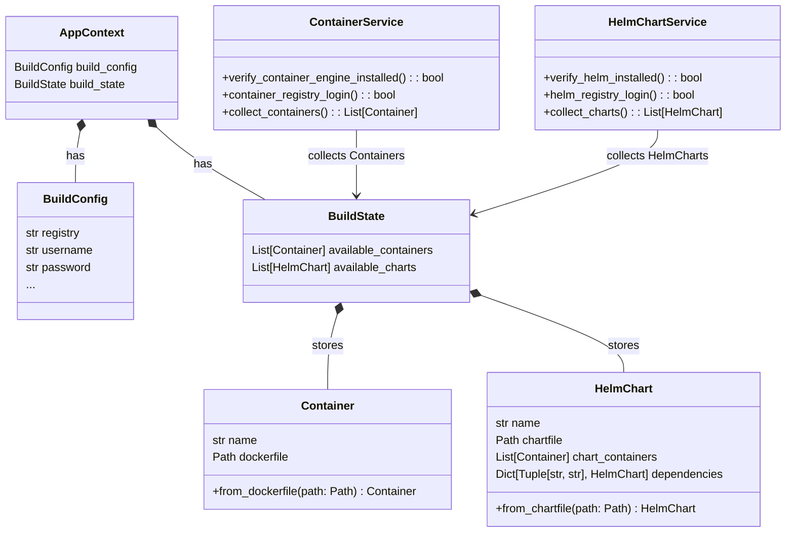

✅ Layered Architecture

build_helper/
├── cli/                   # Entrypoints, commands, CLI scripts
│   └── main.py
│   └── build.py
│
├── models/                # Pydantic and shared data models
│   ├── container.py
│   ├── build_state.py
│   ├── config.py
│   └── issue.py
│
├── services/              # Logic units (build, chart, state, etc.)
│   ├── container_service.py
│   ├── build_service.py
│   ├── chart_service.py
│   └── config_loader.py
│
├── utils/                 # Helpers (e.g., logger setup, git utils)
│   ├── logger.py
│   ├── docker_utils.py
│   └── git_utils.py
│
└── core/                  # Core application objects (app state, context)
    ├── app_context.py     # Dependency injection, shared runtime state
    └── build_runner.py    # Main build loop

🔁 Dependency Flow

    models/ → used by everyone

    utils/ → used by services (but never models)

    services/ → use models + utils

    core/ → orchestrates services

    cli/ → user interface (e.g., click / argparse)

Nothing should import from cli/ or core/
models/ never imports from utils/, services/, or core/

## Diagram



## Sequence diagram
```mermaid
flowchart TD
    %% === Phase 1: Initialize Services ===
    subgraph Phase1[Initialize Build]
        subgraph ContainerService_Init[ContainerService]
            VCE[verify_container_engine_installed]:::container
            CRL[container_registry_login]:::container
        end
        subgraph HelmChartService_Init[HelmChartService]
            VHI[verify_helm_installed]:::helm
            HRL[helm_registry_login]:::helm
        end
    end

    VCE --> CRL
    VHI --> HRL
    
    %% === Phase 2: Collect Containers ===
    subgraph Phase2[Collect Containers]
        subgraph Collect containers[ContainerService]
            CC[(Updates **Build State** with available containers)]:::container
        end
    end

    %% === Phase 3: Collect Charts ===
    subgraph Phase3[Collect Helm Charts]
        %% Loop over each HelmChart
        subgraph ForEachChart["For each HelmChart"]
            subgraph FC[Find Containers]
                infoFC[(Updates **Chart** with available containers resolved from **Build State**)]:::helm
            end

            subgraph FD[Find chart dependencies]
                infoFD[(Updates **Chart** with unresolved - name,version - chart dependencies)]:::helm
            end

            subgraph SCH[Store chart in build state]
                infoSCH[(Updates **build state** with available charts)]:::helm
            end            
        end    
    end

    FC --> FD --> SCH

    %% === Phase 4: Final Build ===
    subgraph Phase4[Final Build]
        BTG[generate_build_tree]
        BLD[build_and_push_containers]
        GEN[package_and_push_charts]
    end


    %% Flow
    Phase1 --> Phase2 --> Phase3 --> Phase4

    %% Styles
    classDef container fill:#d0e6ff,stroke:#00509e,color:#000,stroke-width:1.5px;
    classDef helm fill:#d8f8dc,stroke:#1c5d31,color:#000,stroke-width:1.5px;
    classDef final fill:#ffe8cc,stroke:#8a4b00,color:#000,stroke-width:1.5px;
    classDef hidden fill:none,stroke:none;

