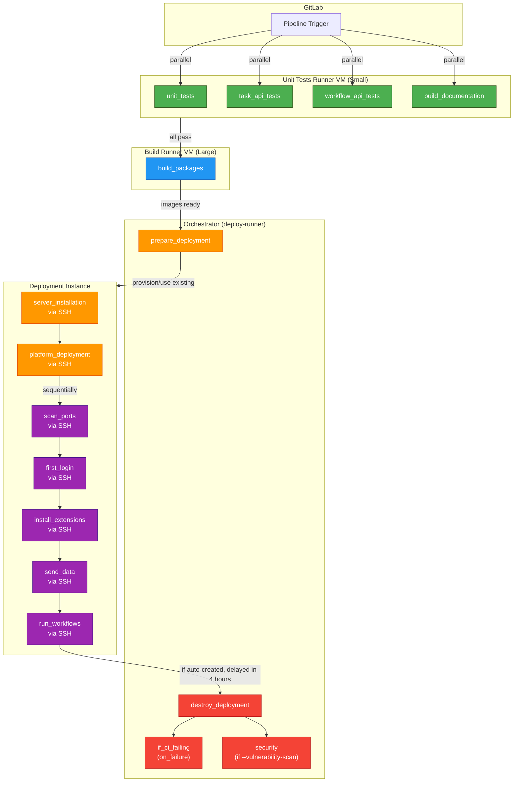

# Kaapana CI/CD Documentation

## CI/CD Pipeline Overview

Kaapana uses **GitLab CI** with five stages across multiple runners:



### Color Legend
- 🟢 **Green**: Tests stage (unit tests, API tests, documentation)
- 🔵 **Blue**: Build stage (build images)
- 🟠 **Orange**: Deploy stage (prepare deployment, server installation, platform deployment)
- 🟣 **Purple**: Test stage (integration tests)
- 🔴 **Red**: Clean stage (destroy deployment, notifications, security reports)

## Architecture

### Hardware Setup
- **Small VM (tests-runner)**: Runs unit tests and documentation builds in parallel
- **Big VM (build-runner)**: Builds Docker container images
- **Orchestrator (deploy-runner)**: Controls deployment and cleanup flow via Ansible
- **Deployment Instance**: Target server where Kaapana runs (auto-created via Harvester or pre-specified)

### Execution Flow
1. **Tests Stage** (Small VM): Unit/API tests + docs build run **in parallel**
   - Artifacts: `tests/` → uploaded to GitLab
2. **Build Stage** (Big VM): Docker images built
   - Artifacts: `build/build.log`, `build/security-reports/` → uploaded to GitLab
3. **Deploy Stage** (via Orchestrator + SSH):
   - `prepare_deployment`: Provisions or uses existing deployment instance (via Harvester kubeconfig) 
   - `server_installation`: Installs dependencies on deployment instance via SSH
   - `platform_deployment`: Deploys Kaapana via SSH
   - Artifacts: `artifacts/` → uploaded to GitLab
4. **Test Stage** (via Orchestrator + SSH): Each integration test runs sequentially on deployment instance
   - Artifacts: `artifacts/` → uploaded to GitLab
5. **Clean Stage** (via Orchestrator):
   - `destroy_deployment`: Destroys deployment instance (runs **after 4 hours** if auto-provisioned, using Harvester kubeconfig)
   - `if_ci_failing`: Creates issue on develop branch if pipeline fails (runs on failure)
   - `security`: Generates vulnerability report if `--vulnerability-scan` flag used
   - Artifacts: All uploaded to GitLab (1 week retention)

## Setting Up GitLab CI

### Requirements
- Maintainer access to GitLab project
- Harvester Kube config (for VM provisioning)
- GitLab API token

### Setup Steps

1. Clone: `git clone https://codebase.helmholtz.cloud/kaapana/kaapana`

2. Install Ansible and collection:
   ```bash
   sudo apt install ansible -y
   ansible-galaxy collection install kubernetes.core
   ```

3. Set required environment variables for runner provisioning:
   ```bash
   export GITLAB_API_TOKEN="your-gitlab-api-token"
   export GITLAB_PROJECT_ID="your-project-id"
   export GITLAB_URL="https://your-gitlab-instance.com"
   export SSH_PUBLIC_KEY="~/.ssh/kaapana-pub.pem"
   export SSH_PRIVATE_KEY="~/.ssh/kaapana.pem"
   export HARVESTER_KUBECONFIG="~/.kube/harvester.yaml"
   ```
   Or use DOTENV file:
   ```bash
   set -a
   source .env
   set +a
   ```
4. Run ansible-playbook to provision runners:
   ```bash
   cd ci/harvester
   
   # Create build runners
   ansible-playbook create-build-runner-instances.yaml -i inventory.yaml
   
   # Create deploy runners
   ansible-playbook create-deploy-runner-instances.yaml -i inventory.yaml
   
   # Create test runners
   ansible-playbook create-tests-runner-instances.yaml -i inventory.yaml
   
   # Force recreate (deletes and recreates existing instances)
   ansible-playbook create-build-runner-instances.yaml -i inventory.yaml -e force_recreate=true
   ```

### Project CI/CD variables

All pipeline variables are declared **with their defaults in `.gitlab-ci.yml`** —
that block is the reference documentation for toggles, VM sizing, runner paths
etc. Project-level variables (Settings → CI/CD → Variables) hold **only secrets
and the registry configuration**. Do not mirror config values there: a project
variable silently overrides the YAML value of the same name (this precedence
bug broke the 0.7.0 release build, see `RELEASING.md`).

The following project variables must be present:

| Variable | Masked | Protected | Description |
| --- | --- | --- | --- |
| `CI_REGISTRY_URL` | no | no | Registry for normal CI builds, e.g. `registry.git.dkfz.de/mic/personal/group1/kaapana-fallback` |
| `CI_REGISTRY_USER` | no | no | Username paired with `CI_REGISTRY_TOKEN`. Shadows the GitLab-predefined `CI_REGISTRY_USER` — if deleted, jobs silently get `gitlab-ci-token` |
| `CI_REGISTRY_TOKEN` | yes | no | Registry push credential; also the default for `GITLAB_API_TOKEN` and `BLABLADOR_API_TOKEN` (see `.gitlab-ci.yml`) |
| `RELEASE_REGISTRY_URL` | no | yes | Release registry, e.g. `registry.hzdr.de/kaapana/releases`. Used only by release tag pipelines |
| `RELEASE_REGISTRY_USER` | no | yes | Username of the release deploy token |
| `RELEASE_REGISTRY_TOKEN` | yes | yes | Secret of the release deploy token |
| `DOCKER_IO_USER` | no | no | docker.io account (avoids anonymous pull rate limits) |
| `DOCKER_IO_PASSWORD` | yes | no | docker.io password |
| `SLACK_BOT_TOKEN` | yes | no | Slack bot for pipeline-failure notifications on develop |
| `SLACK_CHANNEL_ID` | no | no | Slack channel for those notifications |
| `KAAPANA_READTHEDOCS_TOKEN` | yes | no | ReadTheDocs API token for the scheduled docs check |

Optional: create `GITLAB_API_TOKEN` and/or `BLABLADOR_API_TOKEN` as project
variables to move issue creation / AI reports onto their own credentials
instead of the shared `CI_REGISTRY_TOKEN` (see the comment in `.gitlab-ci.yml`).

**How to set them:** either manually in the GitLab UI (Settings → CI/CD →
Variables, check *Mask variable* / *Protect variable* per the table), or in
bulk from the template:

```bash
export GITLAB_API_TOKEN="your-gitlab-api-token"
export GITLAB_PROJECT_ID="your-project-id"
export GITLAB_URL="https://codebase.helmholtz.cloud"

# Fill in the real values first:
cp ci/harvester/control/ci_variables_template.json /tmp/ci_variables.json

python3 ci/harvester/control/set_ci_variables.py \
  --ci-vars-file /tmp/ci_variables.json --dry-run   # drop --dry-run to upload
```

The script cannot set protected variables — create the `RELEASE_REGISTRY_*`
triple manually in the UI.

---

### TBD

1. Configurable destruction delay -> [start_in does not support CI variable expansion](https://gitlab.com/gitlab-org/gitlab/-/work_items/363069)

## Run CI on custom VM

Run pipeline in the UI and specify: `DEPLOYMENT_INSTANCE_FQDN` (and
`DEPLOYMENT_INSTANCE_USER` if not `ubuntu`). Externally-provided VMs are never
destroyed by the clean stage.

