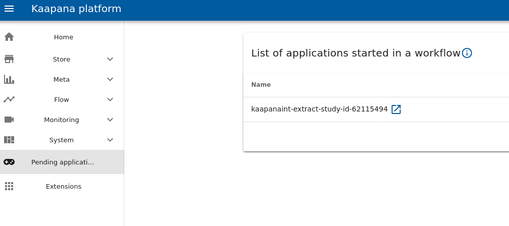

.. _processing_dev_guide:

====================
Processing Dev-Guide
====================

Introduction
------------

In the processing development guide we introduce exemplary projects, that show how the infrastructure of Kaapana 
can be extended by new functionalities, which process data
that is provided by the Kaapana :ref:`storage stack<storage-stack>` and accessible via the meta-dashboard. To process data from the 
meta-dashboard we use the python API for Apache Airflow to create Directed Acyclic Graphs (DAGs). For more details see :ref:`processing stack<processing-stack>`.

.. _write your first own dag:

Write your first own DAG
------------------------

**Aim**: In this chapter we create a DAG that converts DICOMs to ``.nrrd`` files.

.. hint:: 
    DAGs are stored on the host machine inside the subdirectory :code:`workflows/dags` of the :code:`FAST_DATA_DIR`. 
    By default :code:`FAST_DATA_DIR=/home/kaapana`.
    In this directory any file that defines a dag is automatically identified and the dag is available on the platform.

In order to deploy a new DAG that converts DICOMs to nrrds, create a file called ``dag_example_dcm2nrrd.py`` inside the ``dags``-folder with the following content:

.. literalinclude:: ../../../templates_and_examples/examples/processing-pipelines/example/extension/docker/files/dag_example_dcm2nrrd.py
    
You can add this file either directly to the folder, if you have access to the host machine or use the internal code server of Kapaana.
You can install `the code-server-chart` in the extensions tab and open it with the blue icon right next to it.

That's it basically. Now we can check if the DAG is successfully added to Airflow and then we can test our workflow!

* Go to Airflow and check if your newly added DAG ``example-dcm2nrrd`` appears under DAGs (it might take up to five minutes until airflow recognizes the DAG! Alternatively you could restart the Airflow Pod in Kubernetes)
* If there is an error in the created DAG file like indexing, library imports, etc., you will see an error at the top of the Airflow page
* Go to the Meta-Dashboard 
* Filter via the name of your dataset and with ``+/-`` icons on the different charts your images to which you want to apply the algorithm 
* From the drop-down, choose the DAG you have created i.e. ``example-dcm2nrrd`` and press the start button. In the appearing pop-up window press start again and the execution of your DAG is triggered.
* In order to check if your DAG runs successfully, you can go back to Airflow and watch how the pipeline jumps from one operator to the next.
* If everything was successful you can go to Minio where you will find a bucket called ``example-dcm2nrrd``. Inside this folder you will find the ``.nrrd`` files of the selected images.

.. _Deploy an own processing algorithm to the platform:

Deploy an own processing algorithm to the platform
--------------------------------------------------

As a next step we show how a developer can deploy a custom processing algorithm, provided as a python script, to the 
Kaapana platform. In this case the algorithm is a script that extracts the study id of a DICOM study. To access the data 
from the Kaapana storage, we embed it into an Airflow--workflow that opens a DICOM file with Pydicom, extracts the study id, saves 
the study id in a json file and pushes the json file to Minio.
We introduce two different developer-workflows to realize this goal. 

The first workflow will be called the "integrated workflow" and, as the name says, 
integrates the development process into the environment of a running Kaapana platform, which gives us access to the resources of the instance, especially the storage--stack.
The second workflow is called the "local workflow" and describes how one can emulate the Kaapana environment on a local machine.

Integrated Kaapana development workflow
^^^^^^^^^^^^^^^^^^^^^^^^^^^^^^^^^^^^^^^

The approach of the "Integrated development workflow" is to develop the algorithm inside a running docker container on the platform. 
Therefore we first have to provide a base image on our private registry.
Then we will define an operator that pulls this image and starts the container.
The operator itself is executed as part of an Airflow-DAG.
The DAG will be defined in a way that enables us to enter the container of the operator.
Inside the container we can use a code-server to implement the code for the algorithm.
Finally we adjust the formerly empty base image to execute this code.

.. _Provide an empty base image:

Step 1: Provide an empty base image
***********************************

To develop an algorithm within the Kaapana instance we have to provide an image, to start with. 
In this example we provide the algorithm as a python implementation of a DAG (see: :ref:`Write your first own DAG`). 
Therefore, we start with a minimal python image:

.. important::
   To access the base images for our container (like ``local-only/base-python-cpu:latest``) we can either build them individualy following :ref:`faq_build_base_img` or build the whole platform :ref:`build`.
   Building only the base images and not the whole platform is in general recommended as it is a lot faster and takes less space on your system.

.. hint::
    If docker containers should be build on a system **behind a proxy**, please make sure to `configure docker correctly <https://docs.docker.com/network/proxy/#configure-the-docker-client>`_.

.. code-block:: docker

    FROM local-only/base-python-cpu:latest
    LABEL IMAGE="python-template"
    LABEL VERSION="0.1.0"
    LABEL CI_IGNORE="True"

To utilize our base image, we have to push it to our registry. 

.. code-block:: bash

    sudo docker build -t <docker-registry><docker-repo>/example-extract-study-id:0.1.0 .
    sudo docker push <docker-registry><docker-repo>/example-extract-study-id:0.1.0

Since we just used a generic python image as a template for our algorithm and made it available in the Kaapana registry, we can also reuse it for any other
python based algorithm.

.. _Create a developement DAG:

Step 2: Create a development DAG
********************************

In the next step we want to run a container based on the python base image inside the Kaapana platform and access it with the built-in code server to implement our algorithm there.
To do so, we need to create an operator that runs the container. Afterwards we create a DAG to execute the operator.

We define the operator in a file :code:`ExtractStudyIdOperator.py` located under ``dags/example``:

.. literalinclude:: ../../../templates_and_examples/examples/processing-pipelines/example/extension/docker/files/example/ExtractStudyIdOperator.py

The DAG file :code:`dag_example_extract_study_id.py` has to be placed in :code:`dags/` and can look like this:

.. literalinclude:: ../../../templates_and_examples/examples/processing-pipelines/example/extension/docker/files/dag_example_extract_study_id.py 

The DAG is just a sequence of different operators. In this example the ``LocalGetInputDataOperator`` 
loads the data we want to work with. 
The ``ExtractStudyIdOperator`` loads our empty base image and utilizes the Kaapana code-server as development server 
to implement our algorithm inside the active container. 
This is achieved by the ``dev_server="code-server"`` parameter.

.. _Start the Dag and implement the algorithm:

Step 3: Start the Dag and implement the algorithm
*************************************************

Now we want to trigger the DAG, so we go to the meta-dashboard, select the data we want to work with and start our DAG.
The DAG will remain in the execution of the :code:`ExtractStudyIdOperator` due to the parameter ``dev_server="code-server"``.
We can enter the container of this operator via the "Pending applications" tab as shown below.
To access a code-server inside the container click on the blue link icon beside the operator name.

We can now implement and test our algorithm. 
In this example the algorithm is a python script, that extracts the study IDs from the loaded data and returns it.

.. note::
    The code server looks for the ``kaapanasrc`` directory by default. 
    When we use it as dev-server inside the docker container it will prompt an error message, that ``kaapanasrc`` does not exist.
    You can safely ignore this message and open the root directory of the container.

The python file looks like this:

.. literalinclude:: ../../../templates_and_examples/examples/processing-pipelines/example/processing-containers/extract-study-id/files/extract_study_id.py

We just store the python file in the :code:`/kaapanadevdata` directory of the docker container as ``/extract_study_id.py``.
To check if everything works as expected open a terminal in the code-server and run :code:`python3 extract-study-id.py`.
After we are finished we terminate the dev server in the "Pending applications" tab of Kaapana, with the "FINISHED MANUAL INTERACTION" button.

.. hint:: 
    The :code:`/kaapanadevdata` directory in the container of any operator initialized with the parameter ``dev_server="code-server"`` is mounted to the Minio bucket "kaapanadevdata".
    Hence, you don't have to worry that your files in this directory are lost after the container is killed.
    You can also use the Minio bucket to download your files, e.g., in order to build an image in the next step.

.. _push-the-algorithm-to-the-repository:

Step 4: Push the algorithm to the repository
********************************************

When we are finished with the implementation, we push the algorithm to our registry. To do so, we create a ``files`` 
directory beside the :code:`Dockerfile` of the original image and put the :code:`extract-study-id.py` script inside it. 
Then we adjust the :code:`Dockerfile` such that the container executes the script.

.. literalinclude:: ../../../templates_and_examples/examples/processing-pipelines/example/processing-containers/extract-study-id/Dockerfile

Afterwards we can build and push the finished image to our registry.

.. code-block:: bash

    sudo docker build -t <docker-registry><docker-repo>/example-extract-study-id:0.1.0 .
    sudo docker push <docker-registry><docker-repo>/example-extract-study-id:0.1.0

Since we finished the implementation process we also don't want the DAG to initiate a dev-server every time, we can 
delete the ``dev-server="code-server"`` option from the initialization of the ``ExtractStudyIdOperator`` in 
``dag_example_extract_study_id.py``.

.. _Local development workflow:

Local development workflow
^^^^^^^^^^^^^^^^^^^^^^^^^^

Alternatively we can also develop our algorithm on a local machine and then build and push 
the resulting docker image to our registry.

To do so we need to download the data we want to work with. To access the DICOM data for our example, go to the 
Meta-dashboard, select the data you want and trigger the ``download-selected-files`` DAG. 

Additionally, we need to emulate the Kaapana environment on the local machine. We can achieve this by setting several environment variables, which would usually 
be configured by Kaapana automatically. In our case we can just configure the environment variables in the beginning of 
our python script:

.. code-block:: python

    import os

    os.environ["WORKFLOW_DIR"] = "<your data directory>"
    os.environ["BATCH_NAME"] = "batch"
    os.environ["OPERATOR_IN_DIR"] = "initial-input"
    os.environ["OPERATOR_OUT_DIR"] = "output"

Afterwards we build and push the docker image as described in :ref:`push-the-algorithm-to-the-repository`. 
To run the algorithm in Kaapana we load it with an operator and build a DAG as described in :ref:`Create a developement DAG`.  

.. _Provide a workflow as an extension:

Provide a workflow as an extension
----------------------------------

**Aim:** We will write a workflow that applies Otsu's method to create a segmentation of DICOM data.
We want to provide this workflow as an extension to the Kaapana platform.

**Requirements:** You need the image `local-image/dag-installer:0.1.0` available in order to build the image for the DAG.

Step 1: Build an image for the processing algorithm
^^^^^^^^^^^^^^^^^^^^^^^^^^^^^^^^^^^^^^^^^^^^^^^^^^^

First you need to create a directory for the processing algorithm. 
To remain consistent with the structure of Kaapana we recommend to create the new folder in the location 
``kaapana/data-processing/processing-piplines/``, but it can be located anywhere.
::

    mkdir -p otsus-method/processing-containers/otsus-method/files/

In the :code:`files` directory create a file called :code:`otsus_method.py` that contains the segmentation algorithm based on Otsu's method:

.. literalinclude:: ../../../templates_and_examples/examples/processing-pipelines/otsus-method/processing-containers/otsus-method/files/otsus_method.py

In the :code:`otsus-method` directory create a :code:`Dockerfile` with the content:

.. literalinclude:: ../../../templates_and_examples/examples/processing-pipelines/otsus-method/processing-containers/otsus-method/Dockerfile

Starting this container will execute the segmentation algorithm.

To tag the image and push it to the registry, run the following commands inside the :code:`otsus-method` directory.

::

    docker build -t <docker-registry>/<docker-repo>/otsus-method:0.1.0 .
    docker push <docker-registry>/<docker-repo>/otsus-method:0.1.0

.. hint::
     If not already done, you have to log into your Docker registry with :code:`sudo docker login <docker-registry>/<docker-repo>`, 
     before you build the image.

Step 2: Create an image for the DAG 
^^^^^^^^^^^^^^^^^^^^^^^^^^^^^^^^^^^

Create the folder for the DAG image. Inside the outer :code:`otsus-method` directory run:

::

    mkdir -p extension/docker/files/otsus-method

Inside the folder :code:`extension/docker/files/otsus-method` create the :code:`OtsusMethodOperator.py` file

.. literalinclude:: ../../../templates_and_examples/examples/processing-pipelines/otsus-method/extension/docker/files/otsus-method/OtsusMethodOperator.py

Create a python file :code:`dag_otsus_method.py` for the DAG in the folder :code:`extension/docker/files/`

.. literalinclude:: ../../../templates_and_examples/examples/processing-pipelines/otsus-method/extension/docker/files/dag_otsus_method.py
.. hint :: 
    The DAG will perform the following steps:
        - Get the dicom files (LocalGetInputDataOperator), 
        - Convert the dicom files to .nrrd files  (DcmConverterOperator), 
        - Apply the segmentation (OtsusMethodOperator),
        - Create a dicom segmentation from the .nrrd segmentation (Itk2DcmSegOperator ), 
        - Send the data back to the PACS (DcmSendOperator),
        - Clean the workflow dir (LocalWorkflowCleanerOperator).

    **Note:** If you want to use this DAG as a template for your own segmentation algorithm note that 
    :code:`Itk2DcmSegOperator` requires the arguments :code:`segmentation_operator` and
    :code:`single_label_seg_info`.

In :code:`extension/docker/` create the :code:`Dockerfile` for the DAG

.. literalinclude:: ../../../templates_and_examples/examples/processing-pipelines/otsus-method/extension/docker/Dockerfile

.. hint :: 
    The base image :code:`local-only/dag-installer:0.1.0` scans all .py files in :code:`tmp` for images and pulls them via the Helm API.
    It also copies files into desired locations.

Tag the image and push it to the registry. Next to the :code:`Dockerfile` in :code:`extension/docker/` run 

::

    docker build -t <docker-registry>/<docker-repo>/dag-otsus-method:<version-tag> .
    docker push <docker-registry>/<docker-repo>/dag-otsus-method:<version-tag>

.. important :: 
    Setting the correct :code:`<version-tag>` is important, because the platform pulls the DAG with a specific version tag.
    This tag is build as follows: :code:`<platform-abbr>_<platform-version>__<dag-version>`, e.g., :code:`kp_0.1.4__0.1.0`.
    The :code:`platform-abbr` for the kaapana-platform is ``kp`` and for the starter-platform ``sp``.
    The :code:`platform-version` can be found at the bottom of the user interface.
    The :code:`dag-version` is specified in the :code:`Dockerfile` of the DAG.

Step 3: Create the helm chart
*****************************

Create a folder for the chart. Inside :code:`otsus-method/extension/` run 

:: 

    mkdir -p otsus-method-workflow
    cd otsus-method-workflow

Create a file :code:`Chart.yaml`

.. literalinclude:: ../../../templates_and_examples/examples/processing-pipelines/otsus-method/extension/otsus-method-workflow/Chart.yaml

Create a file :code:`requirements.yaml`

.. literalinclude:: ../../../templates_and_examples/examples/processing-pipelines/otsus-method/extension/otsus-method-workflow/requirements.yaml

.. important:: 
    The field :code:`repository` must be the relative path from the file :code:`requirements.yaml` to the directory that contains the 
    :code:`Chart.yaml` file for the dag-installer chart. This file is located in the subdirectory :code:`services/utils/dag-installer/dag-installer-chart/`
    of the kaapana repository.

Create a file :code:`values.yaml`

.. literalinclude:: ../../../templates_and_examples/examples/processing-pipelines/otsus-method/extension/otsus-method-workflow/values.yaml

.. hint:: 
    These three files define the helm chart that will be installed on the platform in order to provide the algorithm as a workflow.

Update helm dependencies and package the chart.

::

    helm dep up 
    helm package .

This will create the file :code:`otsus-method-workflow-0.1.0.tgz`

.. _Add Extension Manually:

Step 4.1: Add the extension manually to the platform
****************************************************

.. warning:: 
    This approach requires root permissions on the host server of the platform.

The easiest way to get the extension into the platform is by copying the packaged helm chart to the right location.
To do so you need access to the host machine, of the platform.
Copy the file :code:`otsus-method-workflow-0.1.0.tgz` to the :code:`extensions/` subdirectory
of the :code:`FAST_DATA_DIR` directory, which is :code:`/home/kaapana/` by default. 

.. hint::
    The :code:`FAST_DATA_DIR` can be configured by editing the :code:`install_platform.sh`
    script before the installation of the platform.

.. warning:: 
    This approach has the disadvantage that the extension only exists in the platform that is deployed on this host machine.
    If you want to provide your algorithm on another platform instance, you have to repeat this step again.
    Step 4.2 shows a persistent approach, where your algorithm is available for each platform that is installed from your private registry.

.. _Add to Extention Collection:

Step 4.2: (Persistent alternative) Update the :code:`kaapana-extension-collection` chart
****************************************************************************************

The Kaapana repository contains a special *collection* chart that depends on a list of other charts required for Kaapana.
You will add the chart of our new DAG to this list and update the dependencies to add the new extension in a persistent way.

First adjust the file :code:`collections/kaapana-collection/requirements.yaml` in your Kaapana repository by adding the following lines its end

::

    - name: otsus-method-workflow
      version: 0.1.0
      repository: file://../../data-processing/processing-pipelines/otsus-method/extension/otsus-method-workflow/

.. hint:: 
    The repository field must point from the :code:`kaapana-extension-collection` chart to the directory of the chart for the DAG.

Now update the dependencies, afterwards build and push the image.
Do all this by executing the following commands in the :code:`collections/kaapana-collection` directory.
::

    helm dep up 
    docker build -t <docker-registry>/<docker-repo>/kaapana-extension-collection:<version-tag> .
    docker push <docker-registry>/<docker-repo>/kaapana-extension-collection:<version-tag>

Finally restart the :code:`kaapana-extension-collection` pod. You can do this in the Kaapana gui by clicking on the cloud button next to **Applications and workflows** in the Extension page.

Alternatively, you can also manually delete the pod on your host machine.
First search for the name of the pod.

::

    kubectl get pods -n default

The name of the pod you need to delete begins with :code:`copy-kube-helm-collections`

::
     
    kubectl delete pod <pod-name>

This will automatically download a new version of the chart and start a new pod.

