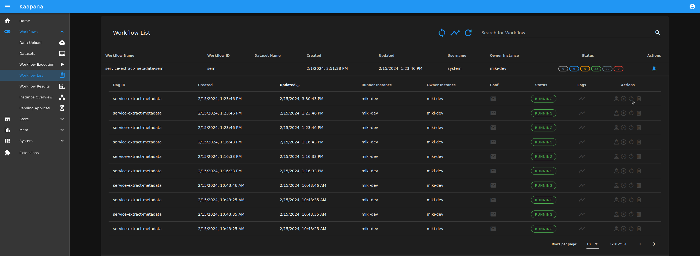

.. _how_to_stop_and_restart_workflows:

How to stop and restart workflows and jobs
*********************************************

Since release 0.2.0 managing workflows is much easier and can be done via `Actions` in the :ref:`Workflow List<workflow_list>` as shown in Figure 1.
Simply by pressing the corresponding button you can abort, restart or delete a :term:`workflow` or a single :term:`job`.

