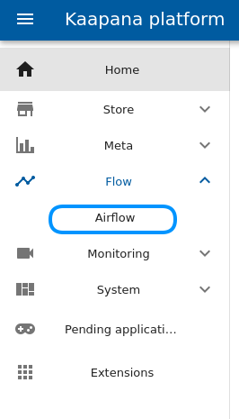
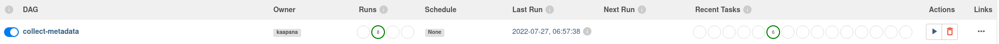
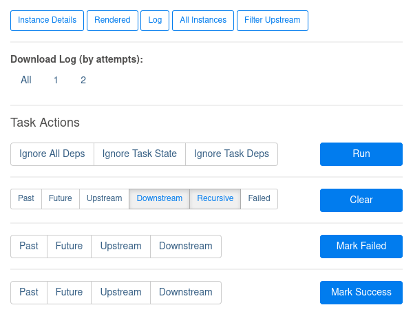

.. _how_to_stop_and_restart_workflows:

How to stop and restart workflows
*********************************

This document explains how workflows that have been started via the Meta-Dashboard can be managed in the 
Apache Airflow user interface.
You can access the Apache Airflow UI via the menu bar.

DAG runs and operators
----------------------
A workflow is also referred to as a DAG (Directed Acyclic Graph).
Each DAG consists of multiple tasks, which are processed following a processing tree.
Each task is associated with a single operator, which is executed as a kubernetes pod.
A DAG run is an institiation of a DAG object and it can be stopped and restarted.

The image from the Apacha Airflow UI for the :code:`collect-metadata` workflow shows the current status of DAG runs and
the status of recent tasks i.e. tasks of currently actice runs or, if no run is active, the tasks of the latest run.

.. note:: 
   The status of a DAG run depends on the status of the leaf nodes of its processing tree.
   Leaf nodes are the tasks which have no children in the tree.
   You can find much more information on DAG runs at the Apache Airflow documentation_.

Restart a task
--------------
If a task in your DAG fails and you need to start it again you can do so by clearing it.
Therefore go to the Tree or Graph view of your DAG run, select the task and click on :code:`Clear`.
If the options :code:`Downstream` and :code:`Recursive` are selected, clearing a task will retrigger all tasks after 
this one, too.

Stop a task
-----------
It might happen that you want to stop a DAG run.
Maybe because it takes to long or you triggered it unintentionally.
If so you can mark a task in the Graph or Tree view as failed by clicking on :code:`Mark Failed`.
This kills the kubernetes pod in which the operator was executed.

.. note:: 
    You can specify multiple options when clearing tasks or marking them as failed.
    These options are especially helpful when you want to change the status of multiple tasks at once.
    You can find more information on how to restart a task and what options are available here_.

.. _here: https://airflow.apache.org/docs/apache-airflow/2.2.5/dag-run.html#re-run-tasks
.. _documentation: https://airflow.apache.org/docs/apache-airflow/2.2.5/
