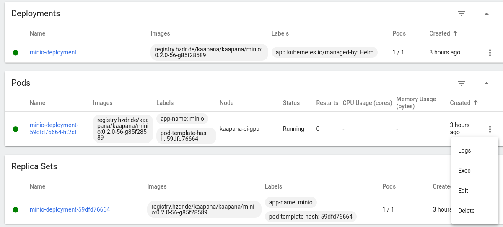

.. _minio_idp_error:

MinIO - Error from IDP
**************************

It might happen that you see the following frame, when opening MinIO

You can fix this issue by restarting the pod for the `minio-deployment` following these steps:

1. In the menu navigate to `System` and `Kubernetes`
2. In the top row select the namespace `services`
3. Search for `minio-deployment`
4. Under `Pods` find the minio-deployment pod (!Not the deployment!), click on the three vertical dots on the right and click on `Delete`.

This will restart the minio-deployment and you should be able to access MinIO as usual.
