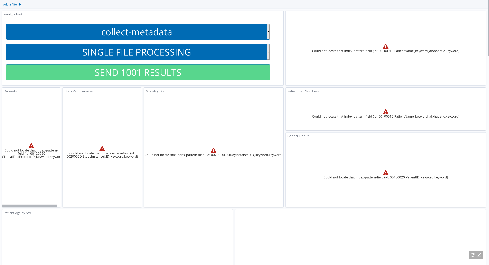

There seems to be something wrong with the landing-page visualization in the Browser

.. toctree::
    :glob:

Kibana dashboard does not work
------------------------------

You open Kibana/Meta and you see something like this?

The error occurred, because the dashboard was opened while not all the meta-data of the images were extracted. You can resolve this by going to

::

    https://<server-domain>/meta

this is the Kibana dashboard. Select "Management" on the left hand side and then "Index Patterns''. Then you should see a panel called "meta-index". On the top right corner there
is a refresh button. By clicking this button the meta-data will be updated for the view. Now your dashboard should work as expected!

.. _faq_doc kubernetes_connection:

Setup a connection to the Kubernetes cluster from your local workstation
------------------------------------------------------------------------

Since the whole software runs within Kubernetes you can connect your local workstation directly to the server and are able to check if the containers
are running or not.

Installation of kubectl
^^^^^^^^^^^^^^^^^^^^^^^
Follow this instructions: `How to install Kubectl <https://kubernetes.io/docs/tasks/tools/install-kubectl/#install-kubectl>`__

To enable the communication between kubectl and the Kubernetes API
server, you need to configure your kubectl with the Kubernetes certificate of the server.
To get this, you need to use the "jip_tools.sh" on the server with:

::

    cat ~/.kube/config

To configure your local machine, you need to create a config file at:

::

    nano ~/.kube/config 

Paste the certificate from above in the file. You should now be able to
communicate with the Kubernetes instance. 

| To check the functionality, you can try:

::

    kubectl get pods --all-namespaces

You should now see a list of some Kubernetes resources.

**IF NOT:** Check the IP-address at the beginning of your config file.

::

    server: <SERVER-IP-ADDRESS>

This should match the IP you are using for SSH into the server.

**ELSE:** Check the date on the server!

Check if the datetime is correct by:

::

    date
    Di 5. Mär 18:08:15 CET 2020

Failing to install an extension 
-------------------------------

Since we use deletion hooks for extension, there might be the problem that the helm release of the extension gets stuck in the uninstalling process. To check if this is the case or if the release is stuck in another stage, get a terminal on your server and execute

::

   helm ls --uninstalled
   helm ls --pending
   helm ls --failed

Then delete the resource with:

::

   helm uninstall <release-name>

If the resource is still there delete it with the ``no-hooks`` options:

::

   helm uninstall --no-hooks <release-name>

Minio is not available because of Error 400
-------------------------------------------

This error usually occurs, when the hostname was set incorrectly in a previous installation.
Follow these steps to fix this issue:

1. Navigate to Systems>Keycloak in the menu bar
2. Click on Administration Console
3. Insert username and password, by default username=admin and password=Kaapana2020
4. Navigate to the menu point Clients in the Keycloak menu bar
5. Click on kaapana in the column Client ID 
6. In the field Valid Redirect URLs change the domain for the Minio URL
   e.g. change
   :code:`https://my.wrong.domain:443/minio-console/oauth_callback/`
   to :code:`https://my-correct-domain:443/minio-console/oauth_callback/`
7. Scroll down and save the changes
8. Press Ctrl+F5 to refresh the page and the cache

