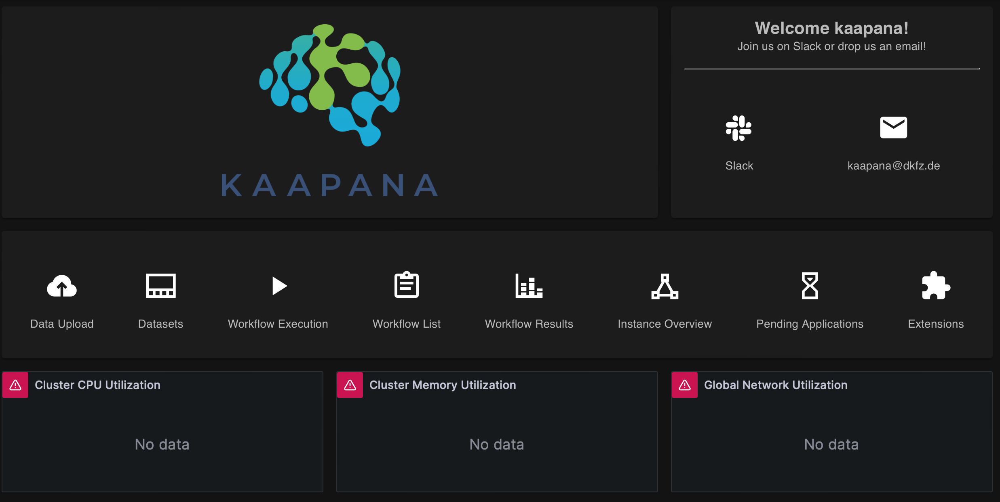

Prometheus Metrics Are Not Displayed
*************************************

Somethime the Home Page does not show any metrics, indicating that Prometheus might not be running properly. This issue often occurs because Prometheus fails to start due to the presence of a lock file.

To resolve this issue, follow these steps:

1. **Delete the lock file**  
   
   Run the following command to remove the lock file from the Prometheus storage directory:

   .. code-block:: bash

      kubectl exec -n kaapana -it <prometheus-pod-name> -- rm -f /prometheus/lock

2. **Restart or delete the Prometheus pod**  

   You can restart the Prometheus pod by deleting it (Kubernetes will automatically recreate it):

   .. code-block:: bash

      kubectl delete pod -n kaapana <prometheus-pod-name>

**Verification:**  
- After the pod restarts, refresh the Home Page and check if the metrics are displayed.  
- If the issue persists, check the Prometheus logs for further debugging:

  .. code-block:: bash

     kubectl logs -n kaapana <prometheus-pod-name>

