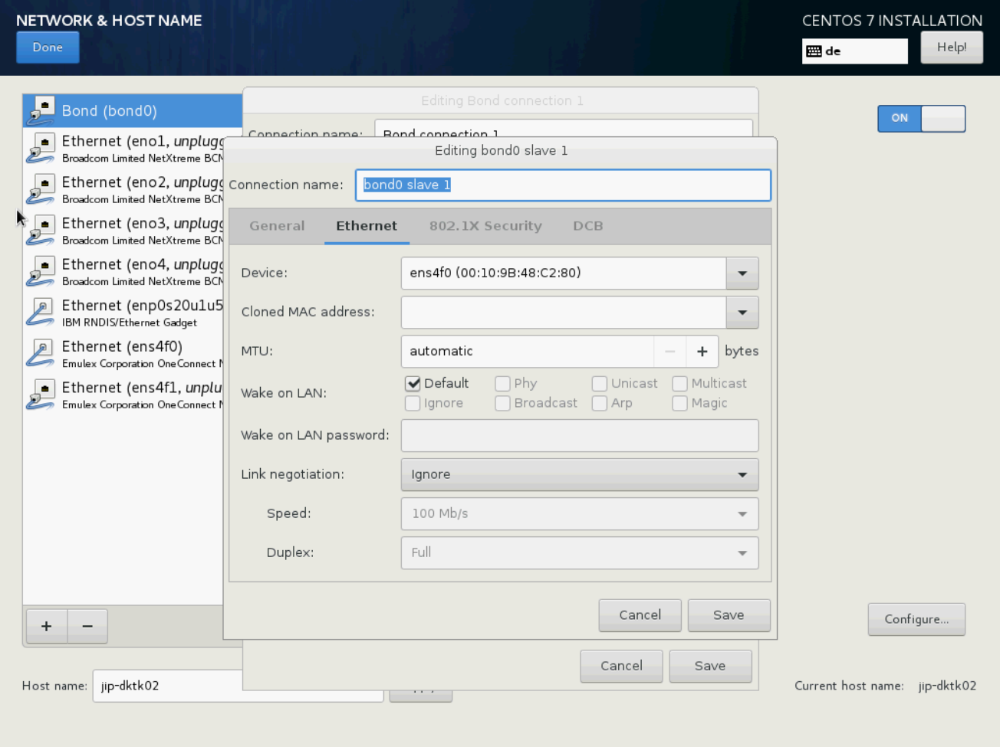
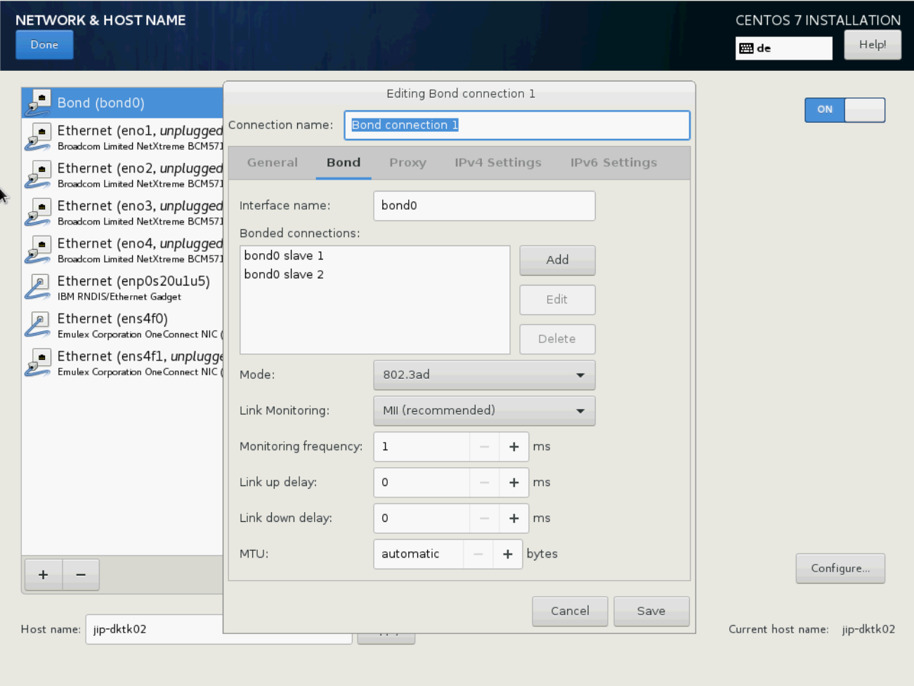

.. _configure_lacp_doc:

Configuration LACP on your server - an example
==============================================

In case you have connected two Ethernet cable to the server and want to bundle the two physical ports together to one single logical channel, you need to configure a Link Aggregation Control Protocol (LACP). The following will show an example how to do it during the installation process. However, also after the CentOS installation, you can still configure the network setting with a tool called nmtui.

-  Press **+** (bottom-menu) and select **Bond** in the popup
-  Press **Add** to add a slave
-  Select **Ethernet** as **Connection Type** and click **Create** (The popup might apppear in the background)
-  Select the desired **Device**
-  Click **Save** to create the first slave

   Configuration of LACP on your server

-  Press **Add** to add the second slave
-  Select again **Ethernet** as **Connection Type** and click **Create** (The popup might apppear in the background)
-  Select the desired **Device**
-  Click **Save** to create the second slave
-  Click on **Round-robin** to select **802.3ad** as **Mode**

-  Select **General** from tabs
-  Check **"Automatically connect to this network when it is
   available"**
-  Select **IPv4 Settings** from tabs
-  Select preferred **Method** (typically manual)
-  If manual select **Add** under "Addresses"
-  Fill in **Address**, **Netmask** and **Gateway** as well as **DNS servers** and **Search domains**
-  **Save**

.. figure:: _static/img/1.4.2.png
   :align: center
   :figwidth: 95 %

   Configuration of the IPv4 settings (Your configuration should differ from the here entered configurations)

If everything is configured correctly, you should now see a
**"Connected"** under the Ethernet device.

-  Select **DONE**