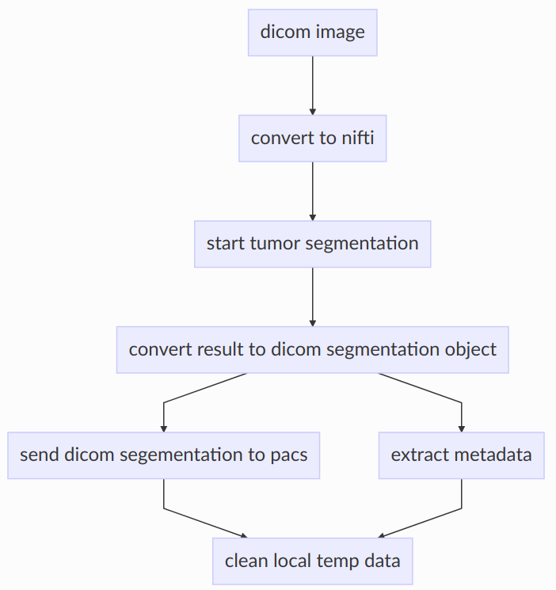
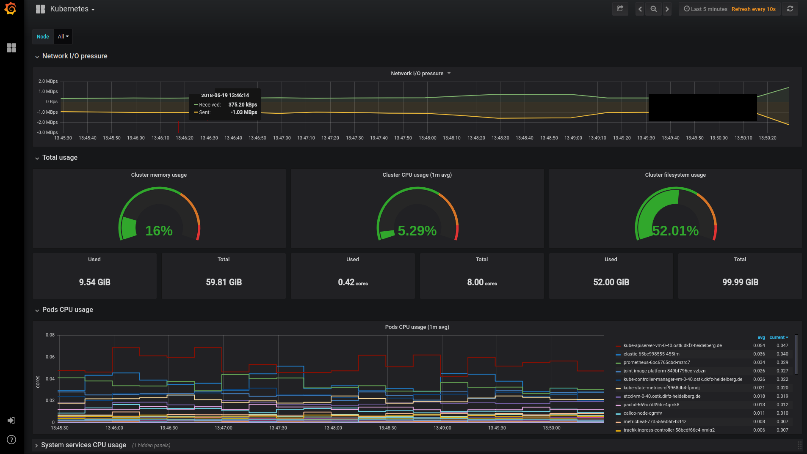
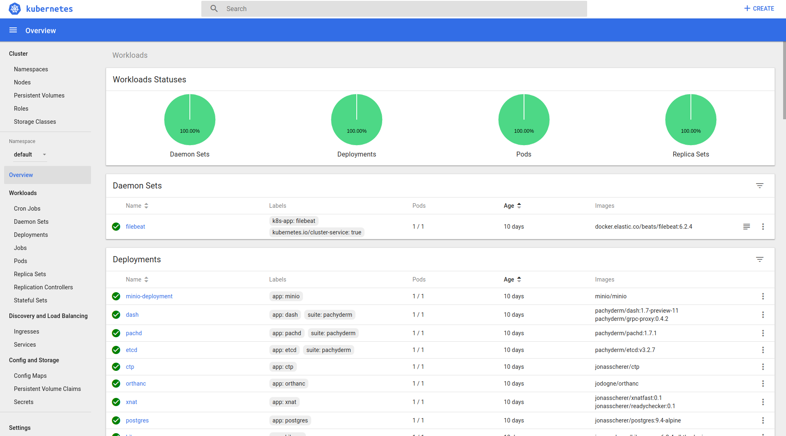

.. _jip_doc:

The **Kaapana ( JIP )** is a strategic initiative within the German Cancer Consortium (DKTK).
The aim is to establish a technical infrastructure that enables modern and distributed imaging
research within the consortium. The main focus is on the use of modern machine learning methods in
medical image processing. It will strengthen collaborations between the participating clinical sites
and support multicenter trails.

The great progress in artificial intelligence and machine learning in recent years has enabled
previously unimaginable research results in computer vision. But these
technologies also introduce some new challenges, especially for the
medical imaging domain.  In order to conduct top-level research in this field,
it is imperative to have large amounts of data available in order to train
and evaluate new algorithms.

These prerequisites present researchers (particularly in medical research) with major challenges.
Data is highly personalized and subject to information privacy requirements.

Within the German Cancer Consortium, there are large amounts of high-quality
datasets waiting for exploration. In order to make them usable for research,
it is necessary to find new solutions. This project attempts to address the
organizational challenges of data protection requirements by **exchanging and
distributing the processing methods rather than patient data**. Every clinical
site therefore retains sovereignty over its own data at all times, no patient
dataset has to leave the clinic IT infrastructure.

The first development stage of Kaapana aims to create a
uniform processing infrastructure at all participating sites. Image
analysis algorithms can be executed, trained and developed in a standardized
manner, facilitating easy exchange and comparison of methods and results across sites.

The basic infrastructure contains all the components required to
operate such a system.  It provides both specialized components for medical
image processing (such as PACS, DICOM receiver, metadata analysis etc.) and
general platform systems (such as user administration, monitoring etc.). One
design goal was to leverage existing standards and established open
technologies as much as possible.

The platform integrates itself into the existing IT system by offering a DICOM
receiver to which you can send images from your existing systems. The platform
itself is operated via a web-based user interface. It is therefore not
necessary to install additional software on workstations - a modern
browser is sufficient.

The following sections of this documentation will describe the components in
more detail, and present a step-by-step guide how to install the JIP software
on your DKTK hardware.

.. raw:: latex

    \clearpage

Structure of the Platform
#########################
The platform is running on servers, which are operated locally at each of the participating sites.
More precisely, the software is a collection of components that are linked together using modern cloud technologies.
This also reflects the platform character, as these components can be easily extended, adapted and exchanged.
The underlying technology is `Docker <https://opensource.com/resources/what-docker>`_. All components and
processing methods are running inside their own container, which brings a lot of benefits.
All containers are then glued together by the container orchestration tool
`Kubernetes <https://kubernetes.io/docs/concepts/overview/what-is-kubernetes/>`_.
This stack of technologies proofed to be very powerful and is widely used as state of the art "datacenter operation system".
We will not go into detail on these topics, as there is already a lot of information online available.

In order to ensure a better overview, we have divided all components into six areas:

- **Base**
- **Store**
- **Meta**
- **Flow**
- **Monitoring**
- **System**

The following sections give a basic overview of each of these areas and describe them.

Base
########
The base section represents the main user interface of the JIP.
It is basically a website which combines the interfaces of all components in a single view.

Store
#########
The Store is responsible for data storage.
The main component is a fully-fledged opensource PACS (`DCM4CHEE <https://www.dcm4che.org/>`_).
There is also a object-store (`Minio <https://www.minio.io/>`_), which will be used to store non DICOM data.
This will also enable the provision of download-links for cohort data and experiment results.
A web-based DICOM viewer (`OHIF <http://ohif.org/>`_) has been integrated to show images in the browser.
The functionality of this viewer is limited at the moment, but more features will come soon.

.. raw:: latex

    \clearpage

Meta
########

Meta makes it possible to visualize and explore the metadata of images.
It allows not only an overview of the data on the system, but is also used to define cohorts for experiments.
By creating filters for desired DICOM tags, the total data set can be stratified.
In addition, the results can be combined with visually appealing graphs in dashboards. 
It is also possible to create your own visualizations and dashboards.
For this functionality mainly two frameworks are used:

- `Elasticsearch <https://medium.com/@victorsmelopoa/an-introduction-to-elasticsearch-with-kibana-78071db3704>`_ as database and search engine for metadata
- `Kibana <https://www.elastic.co/guide/en/kibana/current/introduction.html>`_ for the visualizations and filters

In order to get a basic understanding of visualizations and dashboards,
existing documentation from Kibana can be used.

.. raw:: latex

    \clearpage

Flow
########

Flow contains all components related to processing.
The main component is the workflow engine, which was developed on the basis of `Airflow <https://airflow.apache.org/>`_.
It allows to define pipelines which will execute the algorithms.
Like all other components, processing steps consist of docker containers, which are lined up to achieve
the desired result.

Example of a typical workflow:

All processing containers are also handled by Kubernetes.
This will ensure a completely integrated processing unit.

Since this topic is very extensive and important for the usage of the JIP,
we will dedicate it a separate chapter in this documentation.
The development guide explains the basic principles and gives an introductory example.

It is also important to note that this is **currently work in progress**.
There will be constant updates for both, the documentation, and the framework itself.
Therefore you should use the online documentation to get the latest version.

In addition to the workflow engine, there are also components which are responsible for
the distribution and acceptance of images within the platform. Most importantly, there is the
`Clinical Trial Processor (CTP) <https://mircwiki.rsna.org/index.php?title=MIRC_CTP>`_.
It will open port 11112 on the server to accept DICOM images directly from your clinic PACS.
The rest of the image handling (metadata extraction, PACS storage etc.) will be done automatically by an predefined worflow.

.. raw:: latex

    \clearpage

Monitoring
##########

As with all platforms, a system to monitor the current system status is needed.
To provide this, the JIP utilized a commonly used combination of `Prometheus <https://prometheus.io/>`_ and `Grafana <https://grafana.com/>`_.
The graphical dashboards present states such as disk space, CPU and memory usage, network pressure etc.

For the monitoring of the system components, there is a powerfull Kubernetes dashboard,
which enables all kinds of container monitoring and system adjustment.

System
######
This category includes many functionalities, which are needed as a basis for the system.
Most of them are Kubernetes/network related and therefore left out here.
The only important system to note is `Keycloak <https://www.keycloak.org/>`_, which is used as a identity provider.
The system uses `OpenID Connect <https://openid.net/connect/>`_ as authentication system.
This enables simple user management and the integration of existing LDAP and Kerberos systems.
So you should be able to use the existing user accounts of the hospital infrastructure.
