.. _centos_install_doc:

Server OS Installation
**********************

The installation can be done in different ways.
We describe the two most common approaches:

1. Via the integrated server management system ILO (default and recommended)

   This methods connects via network to the servers management system and installs the operating system remotely.
   This should be the default method. However, it requires a connected and configured server management system (separate network interface).

   | See Section **Via integrated server management system (ILO)**

2. Via a monitor and keyboard attached directly on the server (otherwise)

   If the ILO is not usable, you can still attach a monitor and keyboard to the server and install it directly.

   | See Section **Installation directly on the Server (Monitor attached)**

.. raw:: latex

    \clearpage

Via integrated server management system (ILO)
=============================================

**Requirements:**
  -  Your machine needs access to the servers "ILO" webend
  -  CentOS Minimal (v7.6) ISO on your machine (Download i.e. `here <https://www.centos.org/download/>`_)

Steps:

1. Go to ILO webend 
2. Enter the credentials that were delivered with the server
3. From the tab **Server Management** select **Remote Control**
4. Check **Use the Java Client**
5. Select **Start remote control in single-user mode**

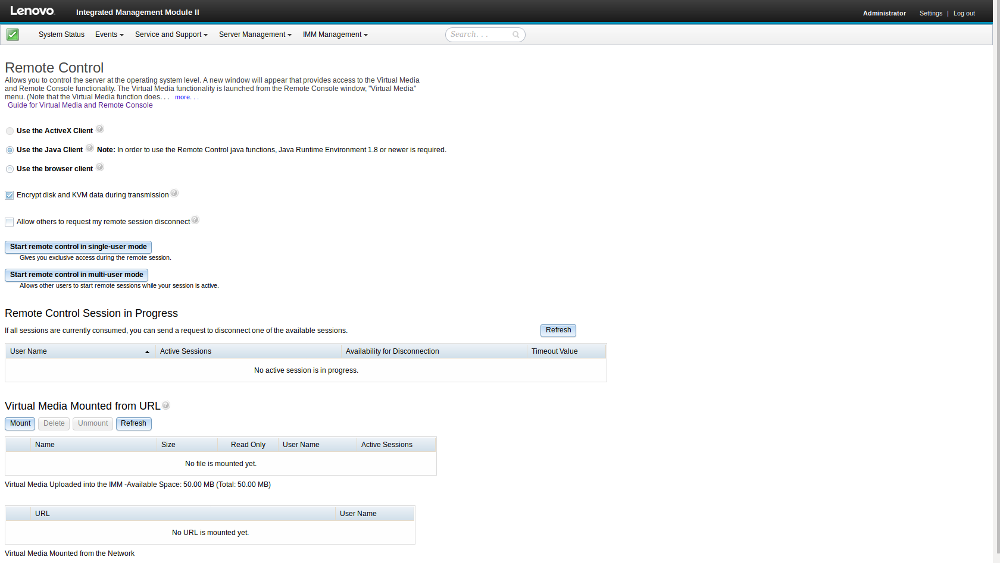

   The Remote Control view with settings

6. Accept popups and wait till the application has loaded
7. Mount ISO image on cd-drive: 
   
   - Select **Virtual Media** from top menu 
   - Check **Activate** - Select **"Select Devices to Mount..."** 
   - Select **"Add Image..."** - Choose your ISO image and select **open** 
   - Check the **"Mapped"**- checkbox at your iso **Select mount** selected
8. Reboot: 

   Select from the top menu: **Tools - Power - Restart the server immediately - yes**
9. Wait until init tests are done (**Platform Initialization complete**)
10. Press **F12** boot-device selection
11. *NOTE: How to navigate in the BIOS? --> look at the information on the bottom of the BIOS screen*
12. Check that Legacy Mode is **NOT** checked

.. figure:: _static/img/0.2.png
   :align: center
   :scale: 38%

   The Boot Device Manager where you can change the legacy mode

13. Leave the Legacy Mode with ESC, go to the Boot Manger and change the boot order such that **CD/DVD Rom** is at the top
14. Leave the menu with **Commit Changes and  Exit**

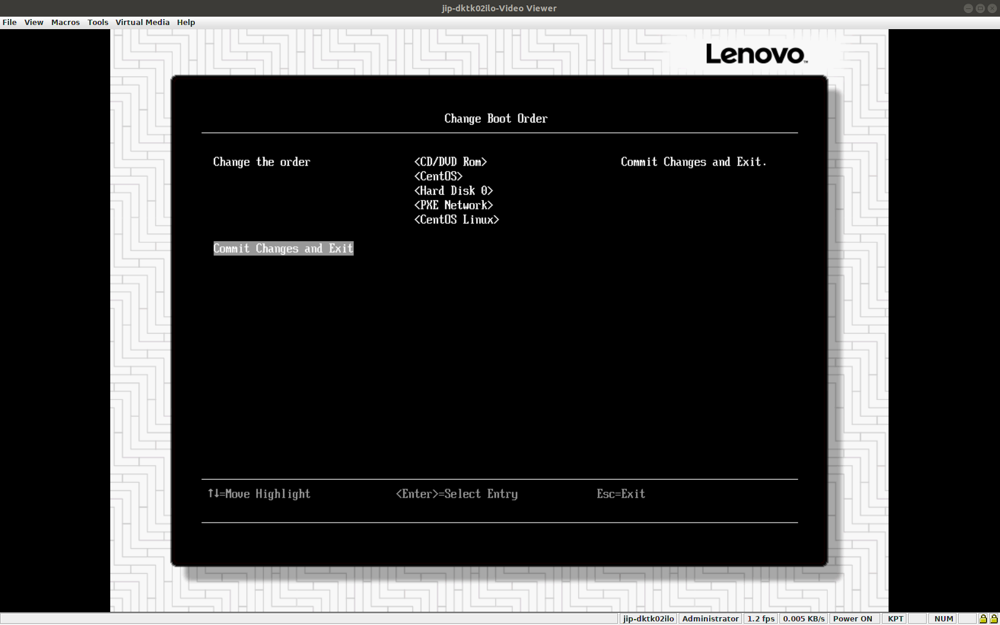

   Change the boot order so that CD/DVD comes first

15. Exit the Boot manager 
(In case you have a German keyboard, select **z** if they ask you to enter **y**) and wait until the following view appears:

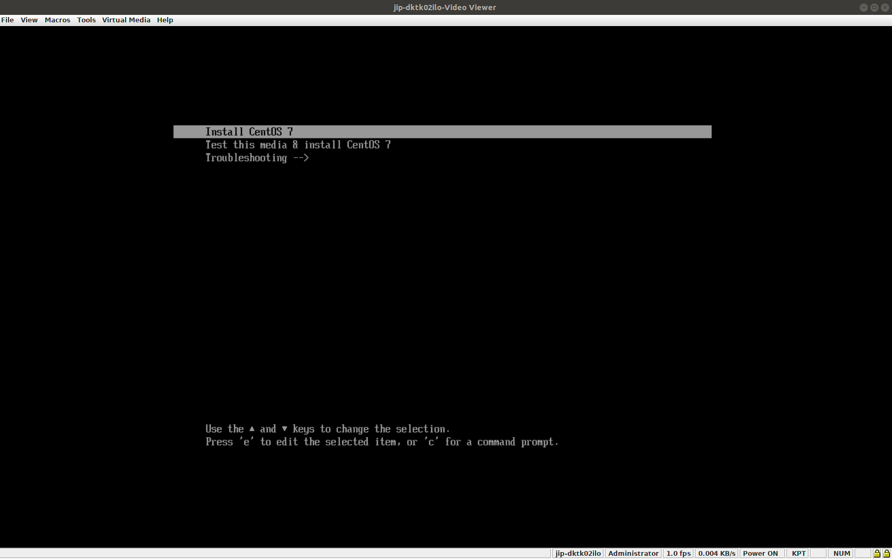

   Install CentOS selection menu

16. Select **Install CentOS 7**
17. Continue with the next section `CentOS Setup`_ and skip Section **Installation directly on the Server (Monitor attached)**

.. raw:: latex

    \clearpage

Installation directly on the Server (Monitor attached)
======================================================

**Requirements:**
  -  Direct access to the server to which a monitor is attached
  -  A bootable USB flash drive with CentOS Minimal (v7.6) ISO (Download i.e. `here <https://www.centos.org/download/>`_)

Steps:
-  Plug in the bootable USB flash drive
-  Start or restart the server
-  Wait until init tests are done (**Platform Initialization complete**)
-  Press **F12** boot-device selection
-  Note: Of how to navigate in the BIOS you find information on the bottom of the BIOS screen
-  Check that Legacy Mode is **NOT** checked (if possible)
-  Go to the Boot Manager and change the boot order such that your USB flash drive is at the top
-  Exit the Boot Manager (In case you have a German keyboard, select **z** if they ask you to enter **y**) and wait until the following view appears:

   Install CentOS selection menu

- Select **Install CentOS 7**
- Continue with the next section `CentOS Setup`_

.. raw:: latex

    \clearpage

CentOS Setup
============
Please follow the next steps to setup the CentOS:

- Select English as language

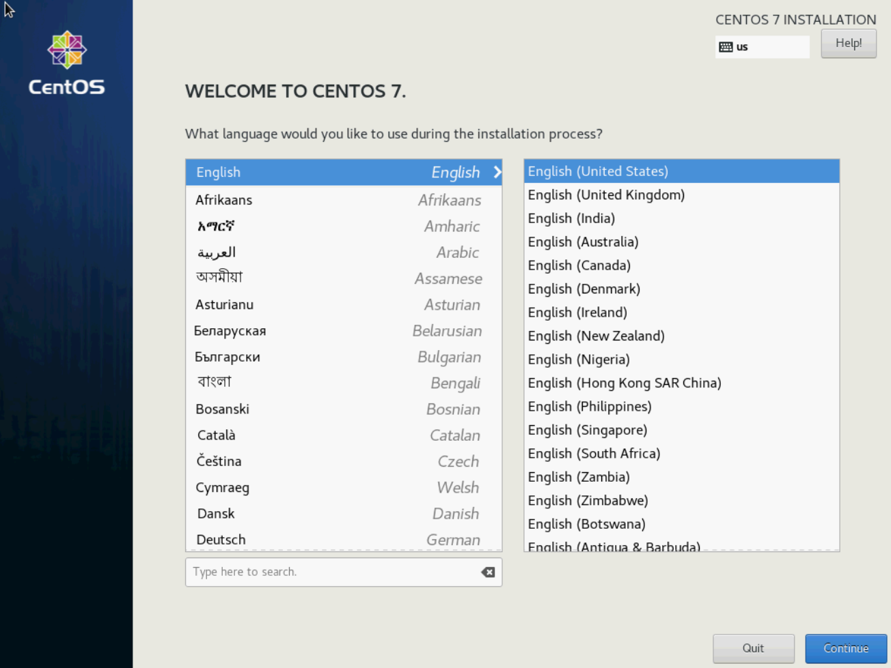

   Welcome view of CentOS where you can change the language

-  Keyboard: Remove English and add German

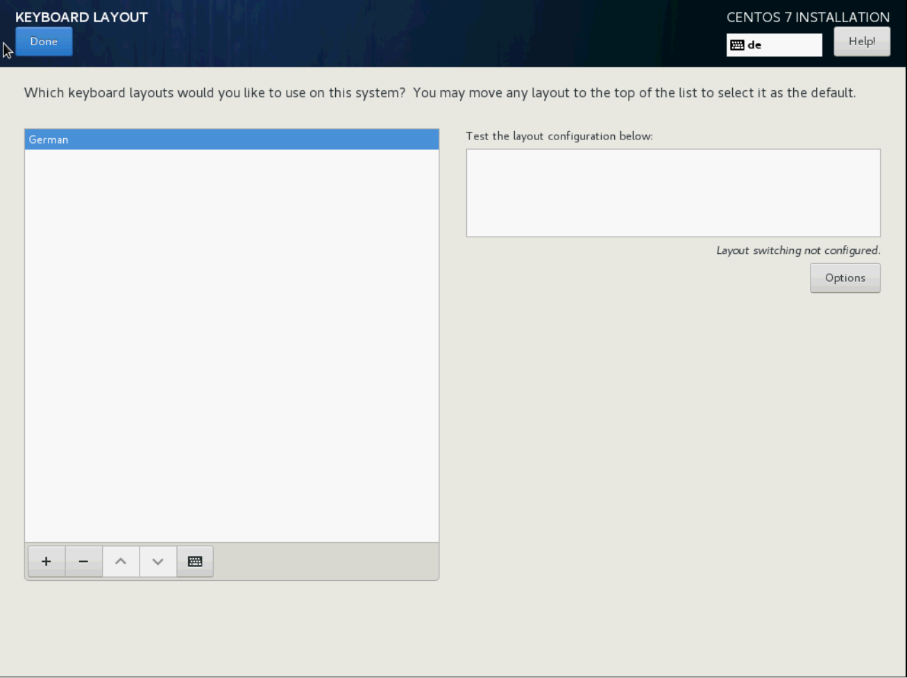

   Keyboard layout of the CentOS system

Installation Destination (Partitioning)
---------------------------------------

-  Select both drives (SSD and HDD) by clicking directly on the drives
-  Select **"I will configure partitioning"**
-  Select Encrypt my data if wanted **Attention: Passphrase will be
   needed for reboot (manual)** This depends on your local policies.
-  Select **Done**

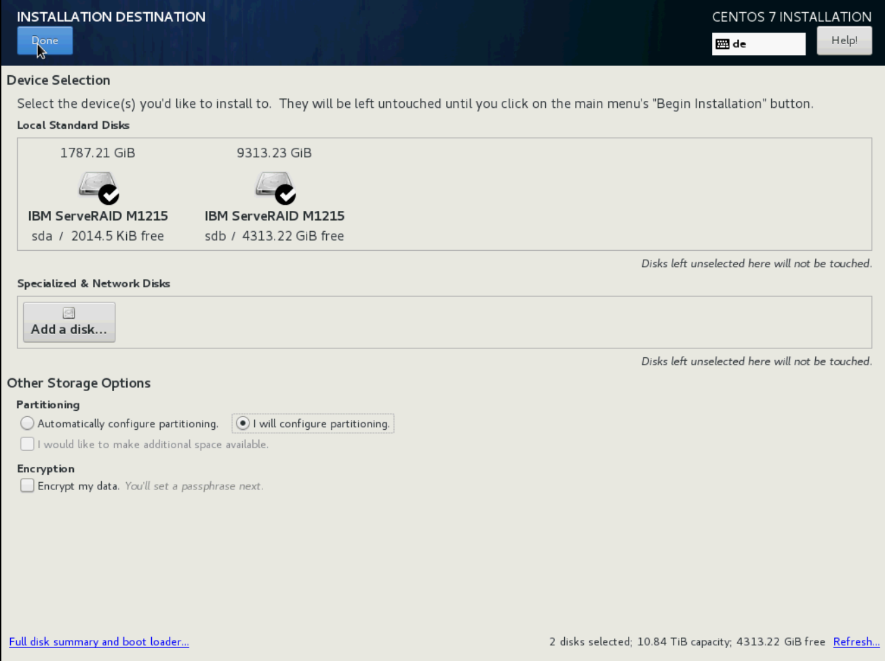

   Installation Destination and Partitioning settings

-  Remove any existing filesystem

   -  **WARNING: ALL DATA WILL BE GONE!!**
   -  If there is any existing fs, it will appear at the end of the list
      (unfoldable)
   -  Select **/home** -> Select "**-**" -> Select **"Delete all file
      systems which are only used by ..."**
   -  **Delete it**

-  Check **LVM** is selected from drop-down
-  Select **"Click here to create them automatically."**

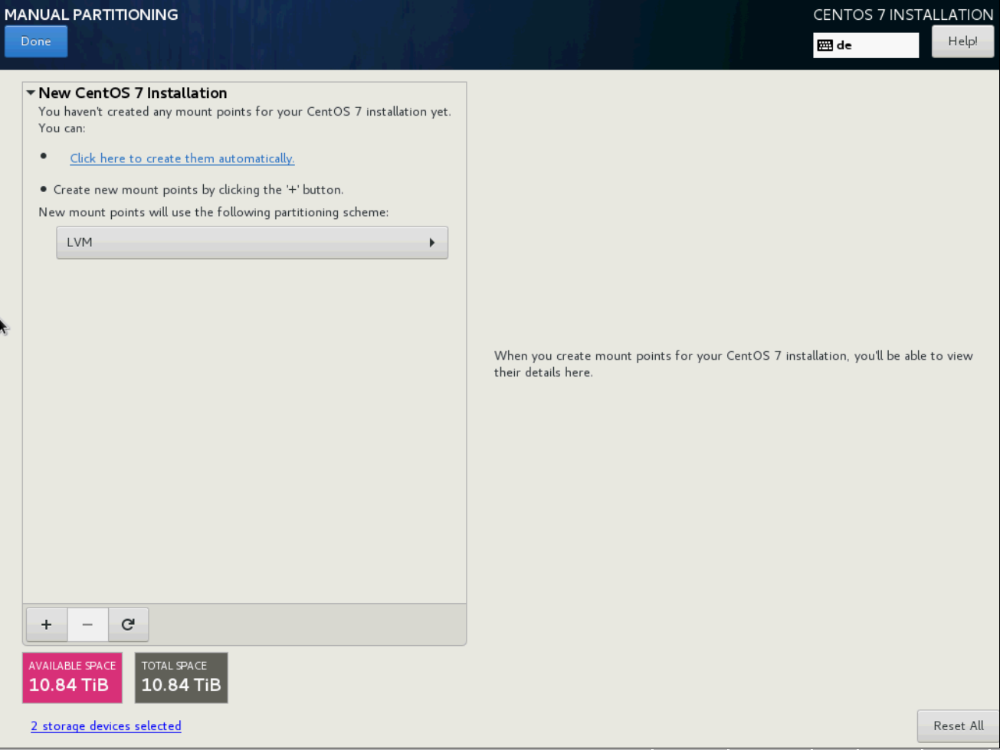
   
   Manual Partitioning page

Remove SWAP partition
^^^^^^^^^^^^^^^^^^^^^

- Select **swap** on the left side
- Remove this entry with **-** (bottom menu)

Configuration for **/home**
^^^^^^^^^^^^^^^^^^^^^^^^^^^
- Select **/home** on the left side
- On the right side: Under **Volume Group** in the dropdown select **Create a new volume group...**
- Give it the Name: **vg-ssd** on the top
- Select the **SSD** - Capacity around 2000 GiB (Only the ssd should be selected)
- Encrypt should be checked if wanted **Attention: Passphrase will be needed for reboot (manual)** This depends on your local policies. 
- Size policy: **As large as possible**
- **Save**

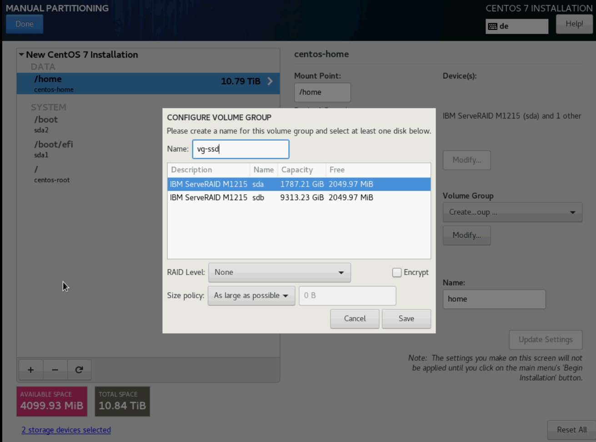

   Configuration of the volume group for /home

- Change **Desired Capacity** to **300 GiB**
- Select **Update Settings** down right

.. figure:: _static/img/1.3.3.png
   :align: center
   :scale: 45%

   The finished configuration for **/home** should look like this

Configuration for **/**
^^^^^^^^^^^^^^^^^^^^^^^
- Select **/** on the left side
- Select the **vg-ssd** volume-group under **Volume Group**
- Change **Desired Capacity** to **80 GiB**
- Select **Update Settings** down right

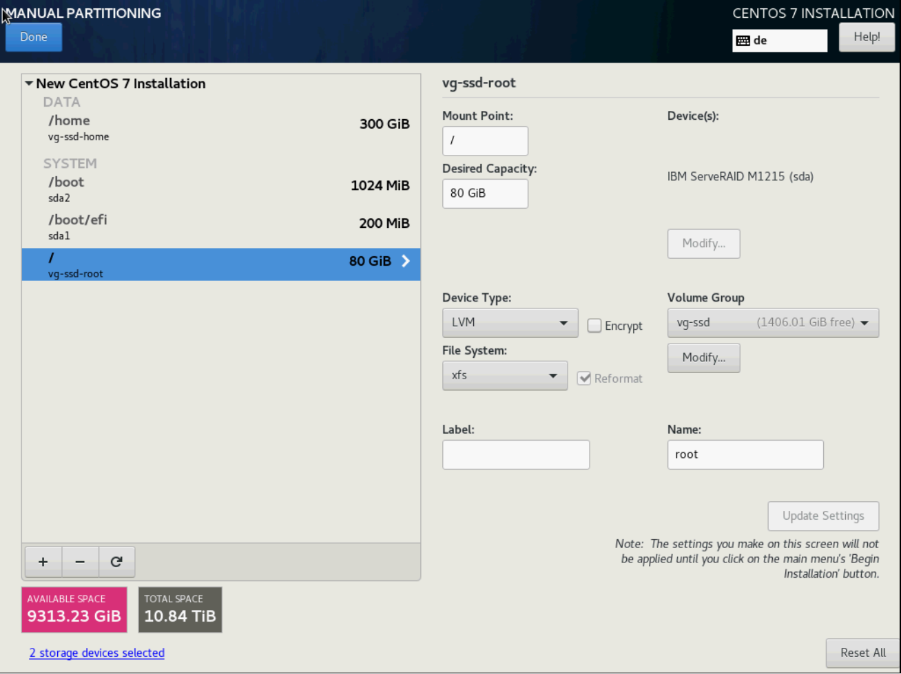

   The finished configuration for **/** should look like this

Add new MOUNT POINT for docker images
^^^^^^^^^^^^^^^^^^^^^^^^^^^^^^^^^^^^^

- Select **+** in the bottom menu
- Type in Mount Point: **/var/lib/docker**
- Desired Capacity: **300 GiB**
- **Add mount point**
- Check that the **vg-ssd** volume-group is selected

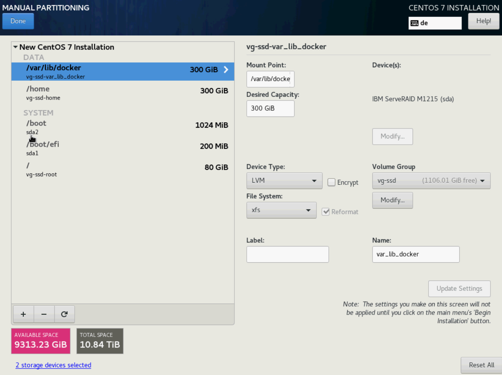

   The finished configuration for **/var/lib/docker** should look like this

Add new MOUNT POINT for DICOM data on HDD
^^^^^^^^^^^^^^^^^^^^^^^^^^^^^^^^^^^^^^^^^

- Select **+**
- Type in Mount Point: **/mnt/dicom**
- Adjust the desired capacity to: **1024 KiB**
- **Add mount point**
- On the right side: Under **Volume Group** in the dropdown select **Create a new volume group...**
- Give it the Name: **vg-hdd** on the top
- Select the **HDD** - Capacity around 10000 GiB (Only the hhd should be selected)
- Encrypt should be checked if wanted **Attention: Passphrase will be needed for reboot (manual)** This depends on your local policies.
- Size policy: **As large as possible**
- **Save**

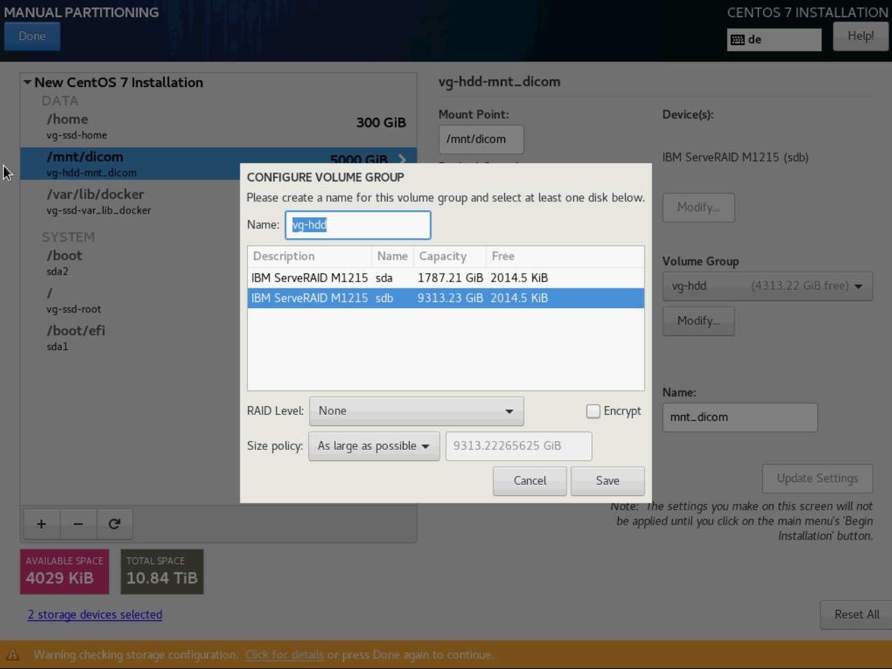

   Configuration of the volume group for /mnt/dicom

- Adjust the capacity to **5000 GiB**
- Check that the **vg-hdd** volume-group is selected
- Select **Update Settings** down right

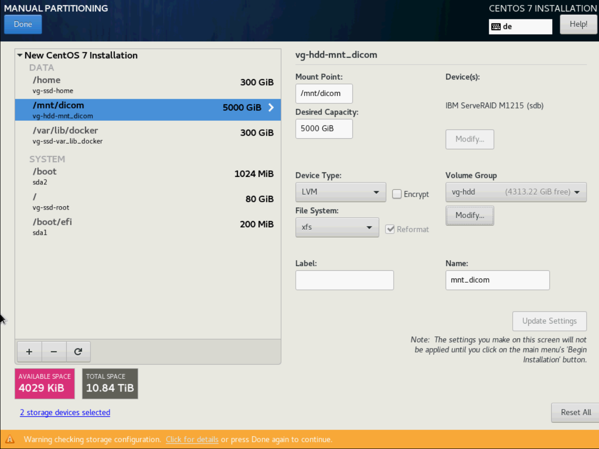

   The finished configuration for **/mnt/dicom** should look like this

The list should now have the following entries:
^^^^^^^^^^^^^^^^^^^^^^^^^^^^^^^^^^^^^^^^^^^^^^^

+-------------------+----------------------------+----------------+
| Mount Point       | Capacity                   | Volume Group   |
+===================+============================+================+
| /home             | 300 GiB                    | vg-ssd         |
+-------------------+----------------------------+----------------+
| /var/lib/docker   | 300 GiB                    | vg-ssd         |
+-------------------+----------------------------+----------------+
| /mnt/dicom        | 5000 GiB                   | vg-hdd         |
+-------------------+----------------------------+----------------+
| /boot             | 1024 MiB                   |                |
+-------------------+----------------------------+----------------+
| /                 | 80 GiB                     | vg-ssd         |
+-------------------+----------------------------+----------------+
| /boot/efi         | 200 MiB (if UEFI system)   |                |
+-------------------+----------------------------+----------------+

-  Select **DONE** at the top left of the screen
-  Enter passphrase for encryption (if this was selected before)
-  Select **DONE** again (the warning is because of the missing swap - that's ok)
-  **Accept Changes**

In case something went wrong you can select **Reset All**. After deleting possible existing file systems you can start over again.

Network & Hostname
------------------

**Attention**: This documentation continues with the assumption that the server has one ethernet cable connected to access the server via ILO and a second (but only *one*)
ethernet cable connected to connect to the clinial network. In case you use two ethernet cable to speed up the connection you need to follow :ref:`configure_lacp_doc` and continue
after you have configured the hostname (cf. end of this section) with section `Start Installation`_ .

-  Select **Network & Hostname**
-  Select the device that is connected to the network
-  Select **Configure**

.. figure:: _static/img/1.4.0.png
   :align: center
   :scale: 45%

   Network and Hostname view (This might look differently in your case)

-  Select the **General** tab
-  Check **"Automatically connect to this network when it is
   available"**

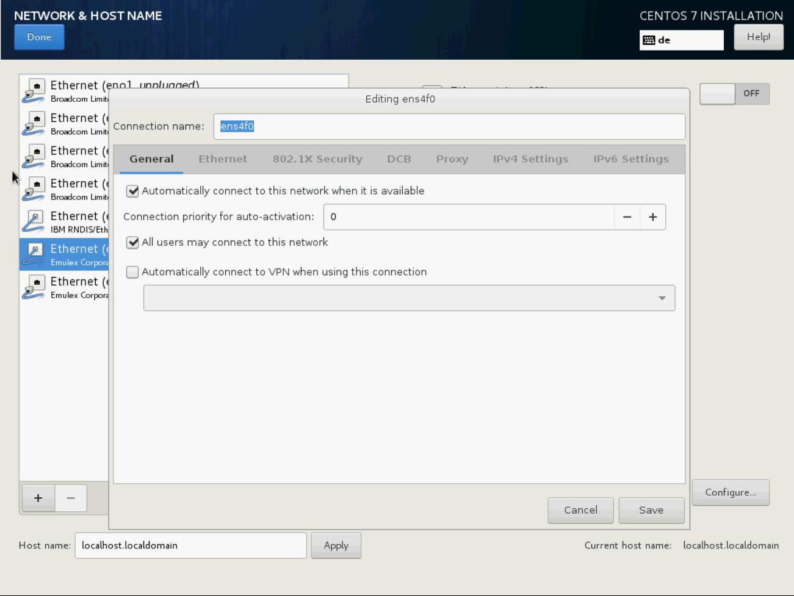

   Network configuration

-  Select the **IPv4 Settings** tab
-  Select preferred **Method** (typically manual)
-  If manual, select **Add** under "Addresses"
-  Fill in **Address**, **Netmask** and **Gateway** as well as **DNS servers** and **Search domains**
-  **Save**

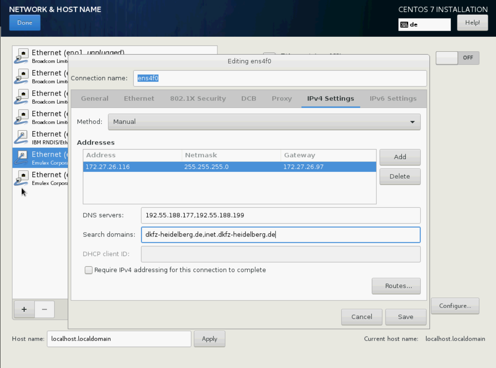

   Configuration of the IPv4 settings (Your configuration should differ from the here entered configurations)

-  If not already activated, activate the configured Ethernet on the top right corner
-  Enter a hostname on the bottom left corner and select **Apply**

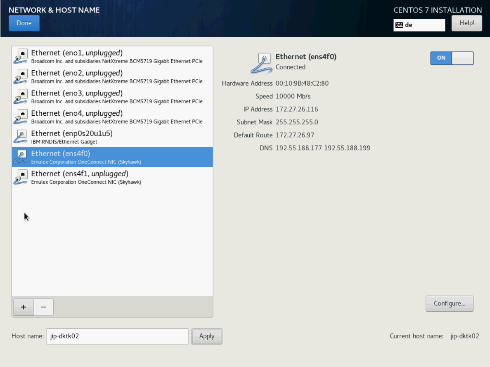

   If everything is configured correctly, you should now see a **"Connected"** under the Ethernet device

-  Select **DONE**

If you realize after the CentOS installation that you still have no network connection you might need to configure a proxy  (:ref:`proxy_conf_doc`).
If this does not help you can still change the network configurations with a tool called nmtui.
**Note**: As stupid as it sounds, but sometimes a reboot helped us or just to wait for a view seconds after adjusting some configurations.

Adjust place and time
---------------------

- Select Europe/Berlin for Date & Time

.. figure:: _static/img/1.1.0.png
   :align: center
   :scale: 45%

   Date and Time settings of the CentOS setup

- In case your institutions uses its own time server, you can adjust at the top right corner a NTP Server
- If you internet connection works, the time should be automatically updated

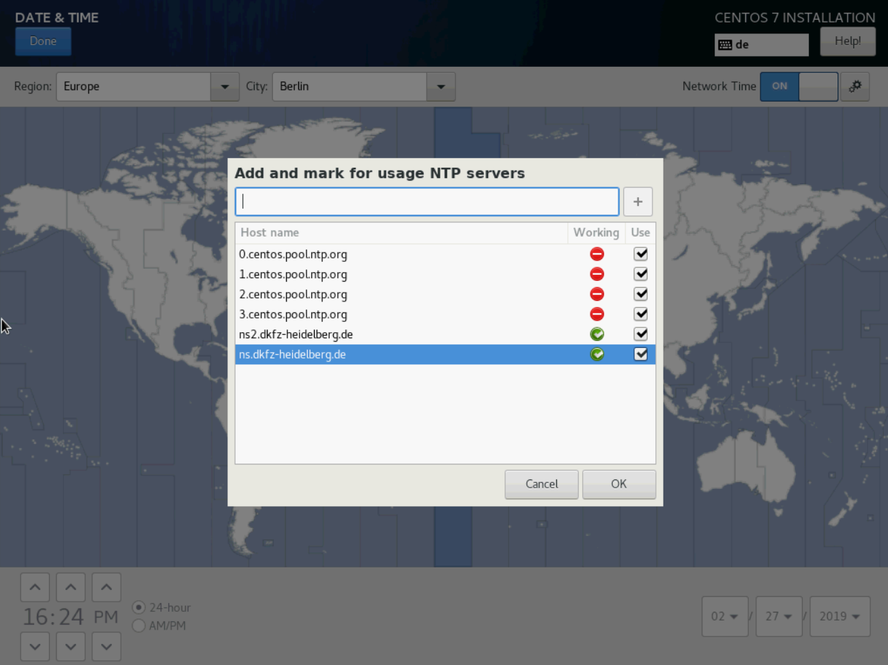

   Select the NTP server of your institution if you want to use your own time server

Start Installation
==================

You are now ready to start the installation!

-  Select **Begin Installation**

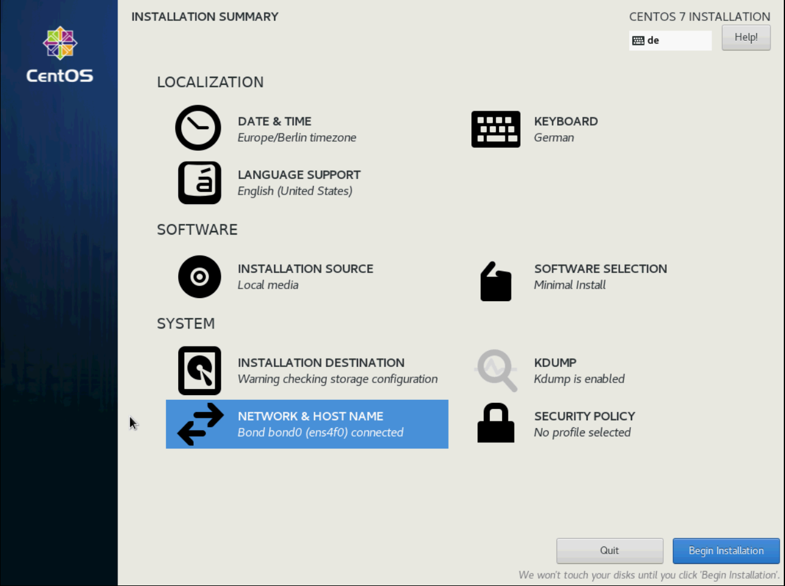

   Installation overview page

-  Configure a **root password**

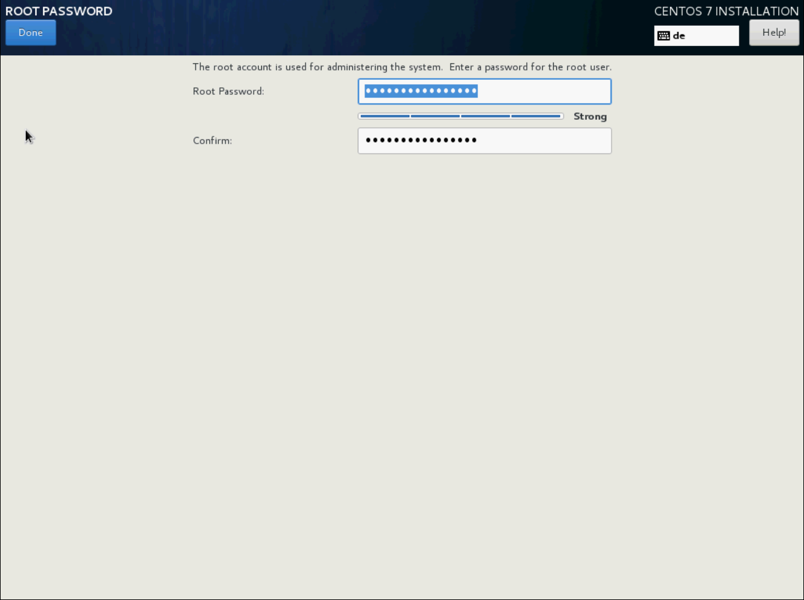

   Setting the root password

-  Configure a **User**. For the default JIP installation a user called **jip** is required

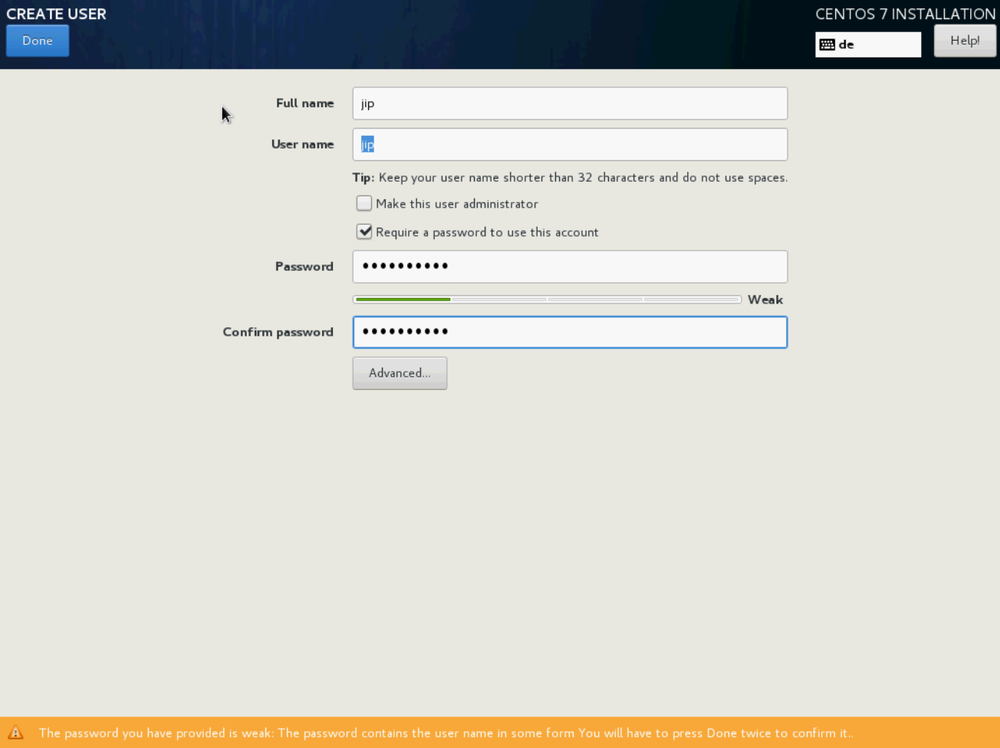

   Creating the default user **jip** on the user configuration page

- **ATTENTION: Write down the passwords and put them in a documentation!!!**
-  Wait till the process is finished
-  Select **Reboot**
-  The system should now boot CentOS from the SSD
-  Enter the disk-decryption password if enabled
-  You should be prompted with the CentOS login-screen

**Attention:** In case your institution has its own time server and you have not already configured it during installation, now is the moment to configure the time correctly.

From here you should connect to the server via **ssh** directly from
your (workstation) machine.

**Attention:** In case your server has no network connection yet, you can not connect via ssh. You can easily check if you have a network connection by installing a package, i.e.:

::

    yum install nano

Once you have a running internet connection you can connect to the server.

Linux:

::

    ssh root@<IP-server>

Windows: You can use a ssh-tool like putty: `download putty
here <https://www.chiark.greenend.org.uk/~sgtatham/putty/latest.html>`_

Alternatively you could login directly as **root** on the server with username: **root** and your assigend root-password.

The installation description will continue with the basic requirement
installation within the :ref:`kaapana_dependencies_doc` document.

.. raw:: latex

    \clearpage