.. _wms start:

Workflow Management System
#####################################

Introduction
^^^^^^^^^^^^

.. TODO: WMS should rather be the whole Workflows tab with all its components (?)
.. Adjust the introduction

Starting from Kaapana version 0.2.0, the Kaapana platform is equipped with a powerful 
Workflow Management System (*WMS*) which allows the user to interact with the also newly 
introduced Kaapana object *workflow*. 
The workflow object semantically binds together multiple jobs, their processing data, 
and the orchestrating- and runner-instances of those jobs. 
In order to manage these workflows, the WMS comes with three components: 
:ref:`workflow_execution`, :ref:`workflow_list` and :ref:`instance_overview`.

.. _data_upload:

Data Upload
^^^^^^^^^^^

.. _datasets:

Datasets
^^^^^^^^

Datasets is the central component to organize and manage the data on the platform. 

* Intuitive Gallery-style view visualizing thumbnails and (configurable) metadata of DICOM Series
* Multiselect which allows performing actions on multiple series at once including add/removing to/from a dataset, executing workflows on individual series or creating new datasets based on the selection
* Configurable side panel metadata dashboard allowing the exploration of metadata distributions (based on selections)
* Intuitive shortcut based tagging functionality allowing fast and convenient annotation and categorization of the data
* (Full-text) search to filter for items based on metadata
* Open a series in a side panel visualizing the DICOM using (an adjusted) OHIF Viewer-v3 next to all Metadata of the specific series.

In the following chapters, we are going to explore the functionalities.

(Structured) Gallery View
-------------------------
Dealing with thousands of DICOMs can be tedious. However, in the recent years, photo gallery apps have established great concepts for those interactions. 
Since DICOMs are not that different from classical images, we got inspired and handel this interaction in similar ways. We call it the Gallery View. 
An item in the Gallery View consists of a thumbnail of the series and its metadata. Everything is completely configurable in :ref:`settings`.
Items are loaded on demand to ensure scalability.

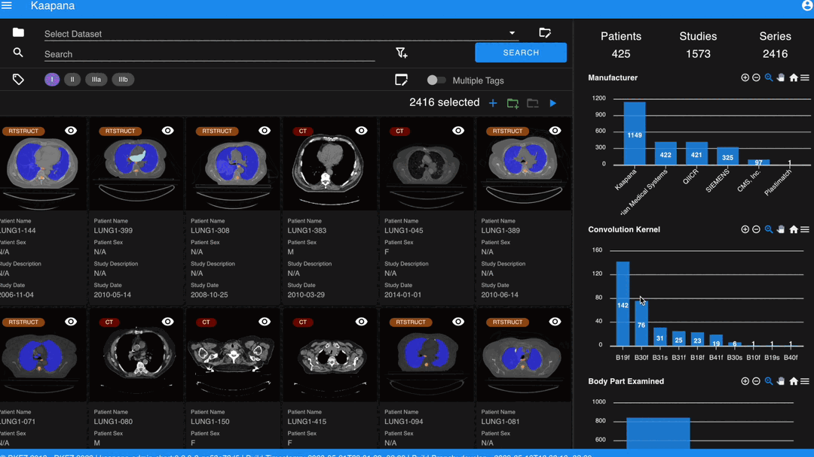

Sometimes it is of interest to structure the data by patient and study. The Structured Gallery View can be enabled in :ref:`settings`.

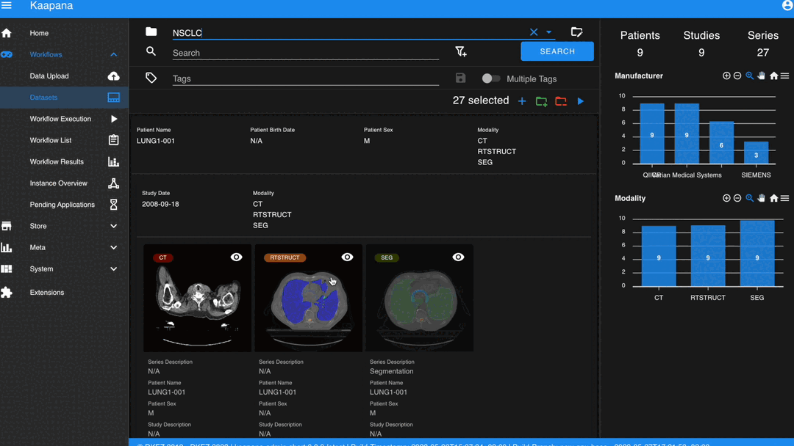

The (Structured) Gallery View enables easy and intuitive interactions with the data on the platform by offering a multi-select functionality. 
Either you select multiple individual series by holding CTRL (CMD on MacOS) and click on the individual series or you make use of the dragging functionality.

Once selected, there are multiple options which are indicated right above the Gallery View. 

* Create a dataset from the selected data. 
* Add selected data to an existing dataset.
* If a dataset is selected (top row), delete the selected items from the currently selected dataset. This only removes the data from the dataset, but does not delete the data from the platform. 
* Execute a workflow with the selected data. Note: While in :ref:`workflow_execution` the dataset is linked to the workflow, triggering a workflow here, will just be a collection of data, i.e. there is no explicit linkage to a dataset.

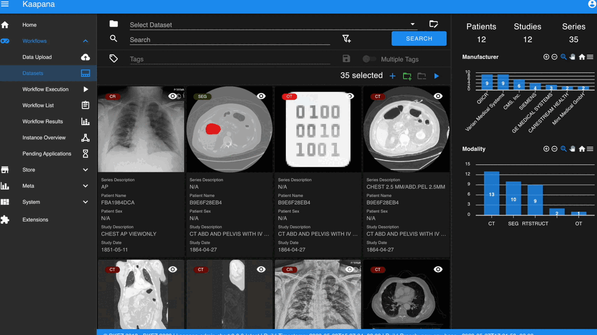

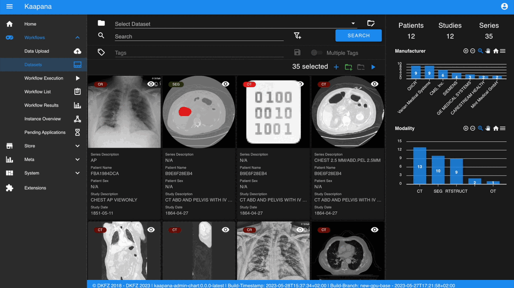

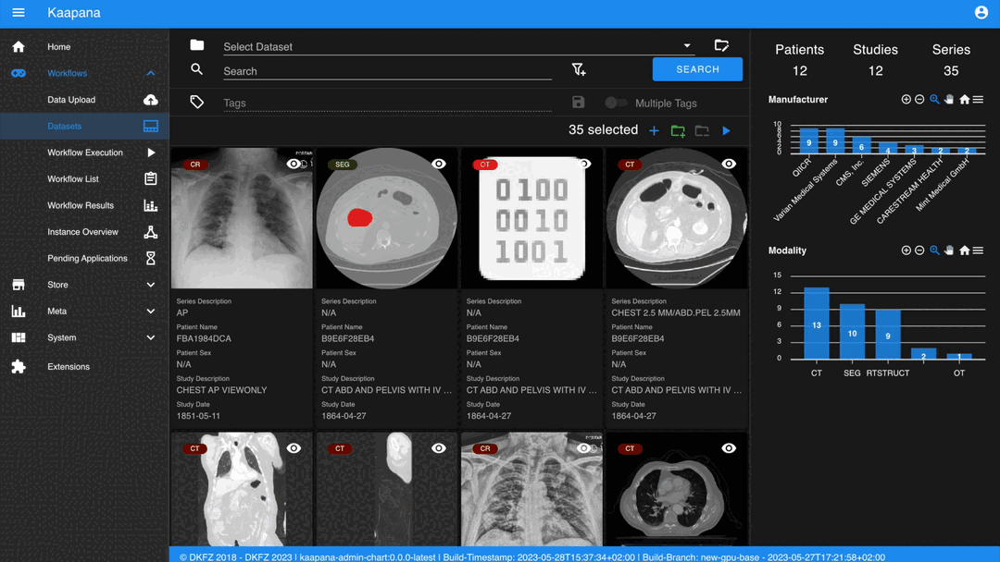

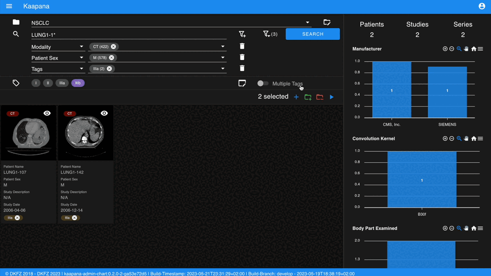

.. note::
  Without an active selection, everything is selected. The 'Items Selected' shows on how many items an action will be performed on.

Dataset management and Workflow Execution
-----------------------------------------
The actions to interact with the (Structured) Gallery View are above it. 
The first row is for selecting and managing the datasets. 
Selecting a dataset will instantly update the (Structured) Gallery View.
Next to the selection, there is a button to open the dataset managment dialog which gives an overview of the datasets on the platform but also allows deleting datasets which are not of need anymore.

.. note::
  Deleting a dataset, does *not* delete its containing data form the platform. 

The next row is for filtering and searching. We offer a lucene-based full-text search. 

.. note::
  Some useful commands: 

  * Use `*` for Wildcarding, e.g. `LUNG1-*`. This will show all series where at least on field in the metadata starts with `LUNG1-`.
  * Use `-` for excluding, e.g. `-CHEST`. This will exclude all series where at least on field in the metadata contains `CHEST`.
  * Checkout the `OpenSearch Documentation <https://opensearch.org/docs/latest/query-dsl/full-text/>`__ .

Additional filters can be added which allow for filtering for specific DICOM tags. It comes with a very convenient autocomplete functionality.

.. note:: 
  Individual filters are combined by `AND`, while the different values within a filter are combined by `OR`.

.. image:: _static/gif/search.gif
   :alt: Filtering

The next row is responsible for tagging, which is a very convenient way to structure the data. 
Tags are free-text, but the autocomplete functionality allows reusing already existing tags. 
First put all tags of interest and save them. 
To tag a series, first activate the tag(s) by clicking on them, and then clicking on the series will tag it. 
The switch next to the tags definition allows enabling multiple tags at once. 

.. note::
* Tags can be activated by shortcuts. Pressing `1` (de-)activates the first tag, pressing `2` the second and so on.
* If a series is already tagged with the current active tag, clicking on the series again, will remove it. This is also the case in multiple tags mode.
* Another way to remove tags is to click on the `X` next to the tag. (Note: If the tag distribution is visualized in the :ref:`meta_dashboard` on the righthand side, removing a tag this way will not update the dashboard)

.. image:: _static/gif/tagging.gif
   :alt: Tagging items in the gallery view

.. _meta_dashboard:

Metadata Dashboard
------------------
Next to the (Structured) Gallery View is the Metadata Dashboard. It is also configurable in the :ref:`settings`.
It visualizes the Metadata of the currently selected items in the (Structured) Gallery View. 

.. note::
  Clicking on a bar in a bar chart will set the selected value as a filter. Only clicking on search will fire the query.

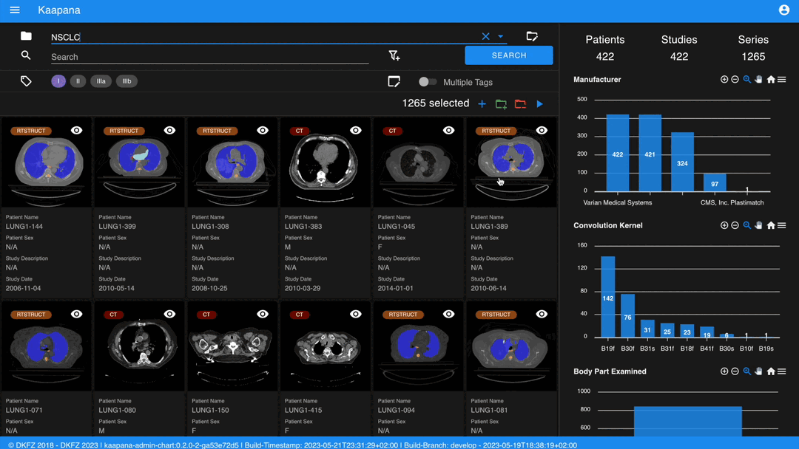

Detail View
-----------
Sometimes a thumbnail of a series is not enough. 
Therefore, by double-clicking on a series card or clicking on the eye in the top-right of the thumbnail will open the detail view in the side panel.
The detail view consists of an (adjusted) OHIF-v3 viewer which allows fast and convenient investigation of the whole series. 
Underneath there is the searchable metadata table with all the metadata for the selected series. 

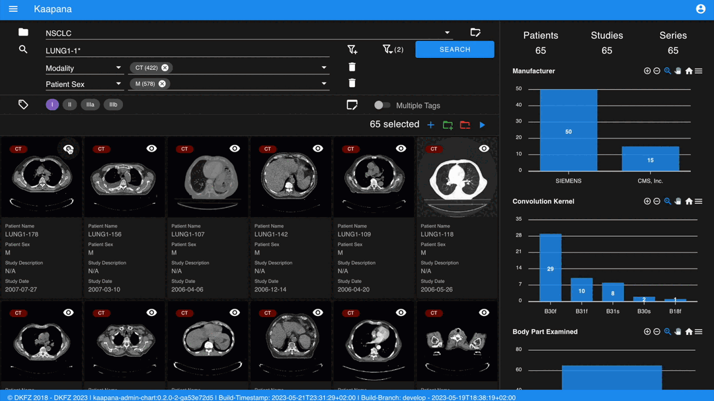

.. _settings:

Settings
---------
.. todo: should we rename it to UI Configurations? 

.. note::
  It might be confusing that settings is mentioned here, but since the Dataset view is so far the only component which makes use of it, we decided to put it here.

Settings can be found by clicking on the user icon on the top right and on then on Settings. A dialog will open.
As mentioned several times before, the Dataset view is very configurable. 
It is not only possible to choose between the Gallery View and Structured Gallery View but its also possible to decide how many items should be visualized in one row. 

It's also configurable if only the thumbnails or also the metadata of a series should be shown.
Furthermore, for each field in the metadata, there are the following options: 

* Dashboard: Visualize the aggregated metadata the Metadata Dashboard
* Patient View: If the Structured Gallery View is enabled, visualize the values in the patient card
* Study View: If the Structured Gallery View is enabled, visualize the values in the series card
* Series Card: Visualize values in the Series Card
* Truncate: If the values in the Series Card should be truncated to a single line. This allows visually aligning the values to easier compare them across series.

Clicking on save will update the configuration and reload the page. 

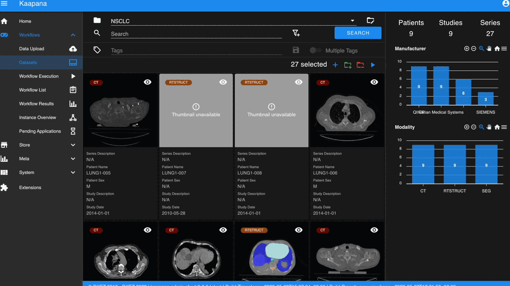

.. note::
  For now, the configuration of Settings is only stored in the browsers localstorage. 
  This has the following implications:

  * Deleting the browser cache will restore the default settings
  * Logging in with a different user from the same computer accesses the same settings
  * Logging in with the same user on a different computer will load the default settings

.. _workflow_execution:

Workflow Execution
^^^^^^^^^^^^^^^^^^

The Workflow Execution component of the WMS serves to configure and execute workflows on 
the Kaapana platform. This component is the only location on the platform to start 
executable instances which will run as DAG-runs in Kaapana`s workflow engine Airflow. 
The Workflow Execution component can either be directly accessed from Workflows -> Workflow Execution 
or from the Datasets component. 
Workflows are configured in the following way:

* specify runner instance(s), i.e. the instances on which jobs of the configured workflow should be executed. Thereby it is worth mentioning that remote and federated workflow executions are in the new WMS more built-in
* select the Airflow-DAG which should be run and further configured with DAG-specific specification
* select a dataset is selected with the data which should be processed within the workflow

.. _workflow_list:

Workflow List
^^^^^^^^^^^^^

The Workflow List component allows users to visualize all workflows that are currently running 
or have previously run on the platform. The Workflow List comes with the following features:

* comprehensive information regarding the specification of each workflow: workflow name, workflow UUID, dataset, time of workflow creation and time of last workflow update, username, owner instance
* live status updates on the jobs associated with each workflow
* set of workflow actions that users can perform, including the ability to abort, restart, or delete workflows and all their associated jobs

Each row of the Workflow List, which represents one workflow, can be expanded to further 
present all jobs which are associated with the expanded workflow. 
This list of job list comes with the following features:

* comprehensive information regarding the specification of each job: ID of Airflow-DAG, time of job creation and time of last job update, runner instance, owner instance (= owner instance of workflow), configuration object, live updated status of the job
* redirect links to the job's Airflow DAG run to access additional details and insights about the job's execution
* redirect links to the Airflow logs of the job's failed operator for troubleshooting and understanding the cause of the failure
* set of job actions that users can perform, including the ability to abort, restart, or delete jobs

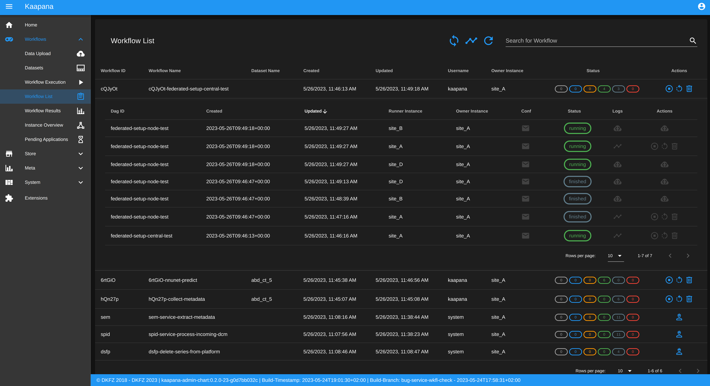

.. _instance_overview:

Instance Overview
^^^^^^^^^^^^^^^^^

The Instance Overview component mainly serves to manage the local instance and its behaviour 
in a remote/federated workflow execution federation as well as the management of connected 
remote instances.

Local instance:
---------------

* comprehensive information regarding the specification of the local instance: instance name, network including protocol and port, token to establish a secure connection to remote instances, time of instance creation and time of last instance update
* configurations which are used in the remote/federated workflow execution can be defined and modified:
  
  - SSL verification and fernet encryption for remote/federated communication
  - remote/federated syncing and execution privileges
  - permissions for the remote/federated usage of Airflow DAGs and datasets

Since the main aim of the Instance Overview component is the usage of the local Kaapana instance 
in a federation, the presented component also offers the possibility to add remote instances, 
which are described in the following.
When it comes to connecting instance, there are a few important things to take care of:

* instance names have to be unique in a federation of connected instances
* when registering a remote instance you have to specify the remote instance`s name, network, token and fernet key exactly the same as these attributes are set on the remote instance itself

Remote instances:
-----------------

* comprehensive information regarding the specification of the local instance: instance name, network including protocol and port, token to establish a secure connection to remote instances, time of instance creation and time of last instance update, SSL verification, fernet encryption, configurations of the connection remote instance regarding remote/federated syncing and execution privileges and permissions for the remote/federated usage of Airflow DAGs and datasets
* on the local instance, the user can define and modify the following specifications of remote instances: port of the network, token, SSL verification and fernet encryption

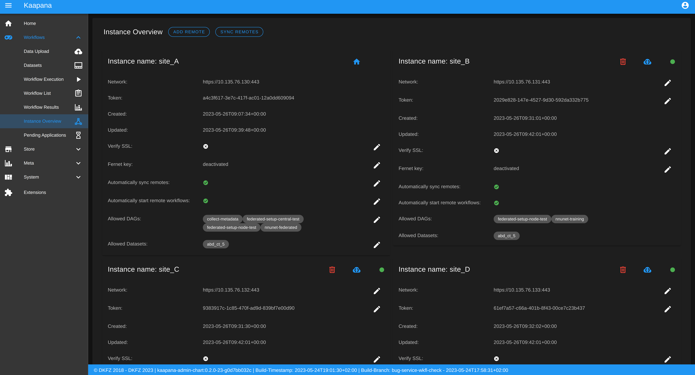

Remote and Federated Workflow Execution
^^^^^^^^^^^^^^^^^^^^^^^^^^^^^^^^^^^^^^^

Workflows can be executed in the following ways:

* Local execution: Workflow is orchestrated by the same instance that serves as runner instance.
* Remote execution: Workflow is orchestrated by another instance that serves as a runner instance.
* Federated execution: The workflows-orchestrating instance coordinates the execution of jobs on both local and remote instances. These jobs then report back data/information to the orchestrating instance. This mode is particularly useful for federated learning scenarios.
  
  - On the orchestrating instance a federated orchestration DAG has to be started which then automatically spawns up runner jobs on the workflow`s runner instances.

Both remote and federated executed workflows are triggered from the Workflow Execution component.
Concerning remote and federated execution of workflows, it is worth mentioning that Kaapana 
provides several security layers in order to avoid adversarial attacks:

* Each Kaapana platform has a username and password-protected login
* The registration of remote instances is handled by the instance name and a random 36-char token
* Each remote/federated communication can be SSL verified if configured
* Each remote/federated communication can be fernet encrypted with a 44-char fernet key if configured
* For each Kaapana platform, the user can configure whether the local instance should check automatically, regularly for updates from connected remote instances or only on demand
* For each Kaapana platform, the user can configure whether the local instance should automatically execute remote/federated workflow jobs which are orchestrated by a connected remote instance
  
  - If automatic execution is not allowed, remote/federated workflows will appear in the Workflow List with a confirmation button

* Remote/federated workflow jobs can always be aborted on the runner instance to give the user of the runner instance full control about her/his instance

Service-workflows
^^^^^^^^^^^^^^^^^

In addition to regular workflows, the Workflow Management System (WMS) also visualizes background 
services within the platform. These services, such as pipelines triggered whenever a DICOM image 
arrives, are represented as service workflows accompanied by service jobs. 
By incorporating these service workflows into the visualization, users can easily track 
and monitor the execution of these important background processes within the platform.

.. raw:: html

   