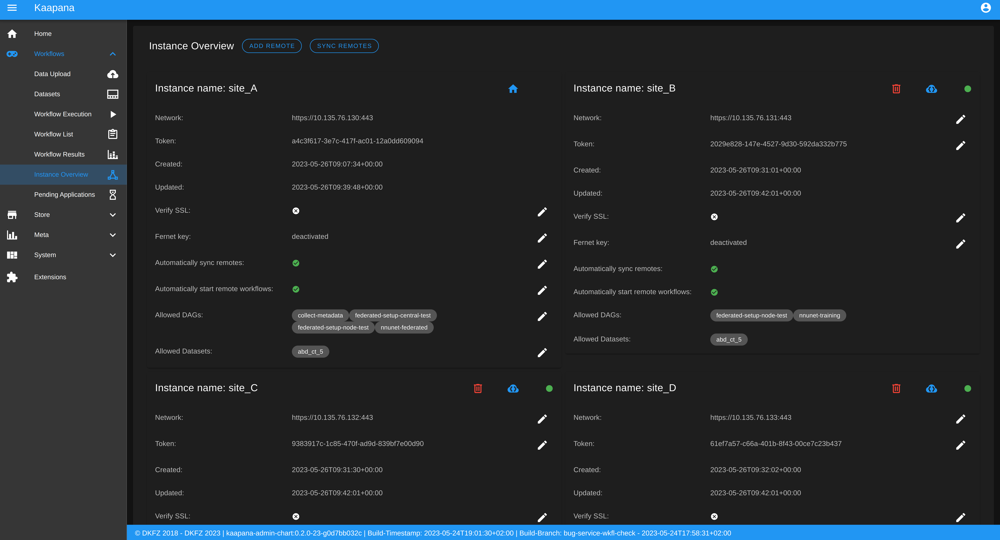

.. _wms start:

Workflow Management System
#####################################

Introduction
^^^^^^^^^^^^

Starting from Kaapana version 0.2.0, the Kaapana platform is equipped with a powerful 
Workflow Management System (*WMS*) which allows the user to interact with the also newly 
introduced Kaapana object *workflow*. 
The workflow object semantically binds together multiple jobs, their processing data, 
and the orchestrating- and runner-instances of those jobs. 
In order to manage these workflows, the WMS comes with three components: 
:ref:`workflow_execution`, :ref:`workflow_list` and :ref:`instance_overview`.

.. _workflow_execution:

Workflow Execution
^^^^^^^^^^^^^^^^^^

The Workflow Execution component of the WMS serves to configure and execute workflows on 
the Kaapana platform. This component is the only location on the platform to start 
executable instances which will run as DAG-runs in Kaapana`s workflow engine Airflow. 
The Workflow Execution component can either be directly accessed from Workflows -> Workflow Execution 
or from the Datasets component. 
Workflows are configured in the following way:

* specify runner instance(s), i.e. the instances on which jobs of the configured workflow should be executed. Thereby it is worth mentioning that remote and federated workflow executions are in the new WMS more built-in
* select the Airflow-DAG which should be run and further configured with DAG-specific specification
* select a dataset is selected with the data which should be processed within the workflow

.. _workflow_list:

Workflow List
^^^^^^^^^^^^^

The Workflow List component allows users to visualize all workflows that are currently running 
or have previously run on the platform. The Workflow List comes with the following features:

* comprehensive information regarding the specification of each workflow: workflow name, workflow UUID, dataset, time of workflow creation and time of last workflow update, username, owner instance
* live status updates on the jobs associated with each workflow
* set of workflow actions that users can perform, including the ability to abort, restart, or delete workflows and all their associated jobs

Each row of the Workflow List, which represents one workflow, can be expanded to further 
present all jobs which are associated with the expanded workflow. 
This list of job list comes with the following features:

* comprehensive information regarding the specification of each job: ID of Airflow-DAG, time of job creation and time of last job update, runner instance, owner instance (= owner instance of workflow), configuration object, live updated status of the job
* redirect links to the job's Airflow DAG run to access additional details and insights about the job's execution
* redirect links to the Airflow logs of the job's failed operator for troubleshooting and understanding the cause of the failure
* set of job actions that users can perform, including the ability to abort, restart, or delete jobs

.. image:: _static/img/wms_workflow_list.png

.. _instance_overview:

Instance Overview
^^^^^^^^^^^^^^^^^

The Instance Overview component mainly serves to manage the local instance and its behaviour 
in a remote/federated workflow execution federation as well as the management of connected 
remote instances.

Local instance:
---------------

* comprehensive information regarding the specification of the local instance: instance name, network including protocol and port, token to establish a secure connection to remote instances, time of instance creation and time of last instance update
* configurations which are used in the remote/federated workflow execution can be defined and modified:
  
  - SSL verification and fernet encryption for remote/federated communication
  - remote/federated syncing and execution privileges
  - permissions for the remote/federated usage of Airflow DAGs and datasets

Since the main aim of the Instance Overview component is the usage of the local Kaapana instance 
in a federation, the presented component also offers the possibility to add remote instances, 
which are described in the following.
When it comes to connecting instance, there are a few important things to take care of:

* instance names have to be unique in a federation of connected instances
* when registering a remote instance you have to specify the remote instance`s name, network, token and fernet key exactly the same as these attributes are set on the remote instance itself

Remote instances:
-----------------

* comprehensive information regarding the specification of the local instance: instance name, network including protocol and port, token to establish a secure connection to remote instances, time of instance creation and time of last instance update, SSL verification, fernet encryption, configurations of the connection remote instance regarding remote/federated syncing and execution privileges and permissions for the remote/federated usage of Airflow DAGs and datasets
* on the local instance, the user can define and modify the following specifications of remote instances: port of the network, token, SSL verification and fernet encryption

Remote and Federated Workflow Execution
^^^^^^^^^^^^^^^^^^^^^^^^^^^^^^^^^^^^^^^

Workflows can be executed in the following ways:

* Local execution: Workflow is orchestrated by the same instance that serves as runner instance.
* Remote execution: Workflow is orchestrated by another instance that serves as a runner instance.
* Federated execution: The workflows-orchestrating instance coordinates the execution of jobs on both local and remote instances. These jobs then report back data/information to the orchestrating instance. This mode is particularly useful for federated learning scenarios.
  
  - On the orchestrating instance a federated orchestration DAG has to be started which then automatically spawns up runner jobs on the workflow`s runner instances.

Both remote and federated executed workflows are triggered from the Workflow Execution component.
Concerning remote and federated execution of workflows, it is worth mentioning that Kaapana 
provides several security layers in order to avoid adversarial attacks:

* Each Kaapana platform has a username and password-protected login
* The registration of remote instances is handled by the instance name and a random 36-char token
* Each remote/federated communication can be SSL verified if configured
* Each remote/federated communication can be fernet encrypted with a 44-char fernet key if configured
* For each Kaapana platform, the user can configure whether the local instance should check automatically, regularly for updates from connected remote instances or only on demand
* For each Kaapana platform, the user can configure whether the local instance should automatically execute remote/federated workflow jobs which are orchestrated by a connected remote instance
  
  - If automatic execution is not allowed, remote/federated workflows will appear in the Workflow List with a confirmation button

* Remote/federated workflow jobs can always be aborted on the runner instance to give the user of the runner instance full control about her/his instance

Service-workflows
^^^^^^^^^^^^^^^^^

In addition to regular workflows, the Workflow Management System (WMS) also visualizes background 
services within the platform. These services, such as pipelines triggered whenever a DICOM image 
arrives, are represented as service workflows accompanied by service jobs. 
By incorporating these service workflows into the visualization, users can easily track 
and monitor the execution of these important background processes within the platform.

