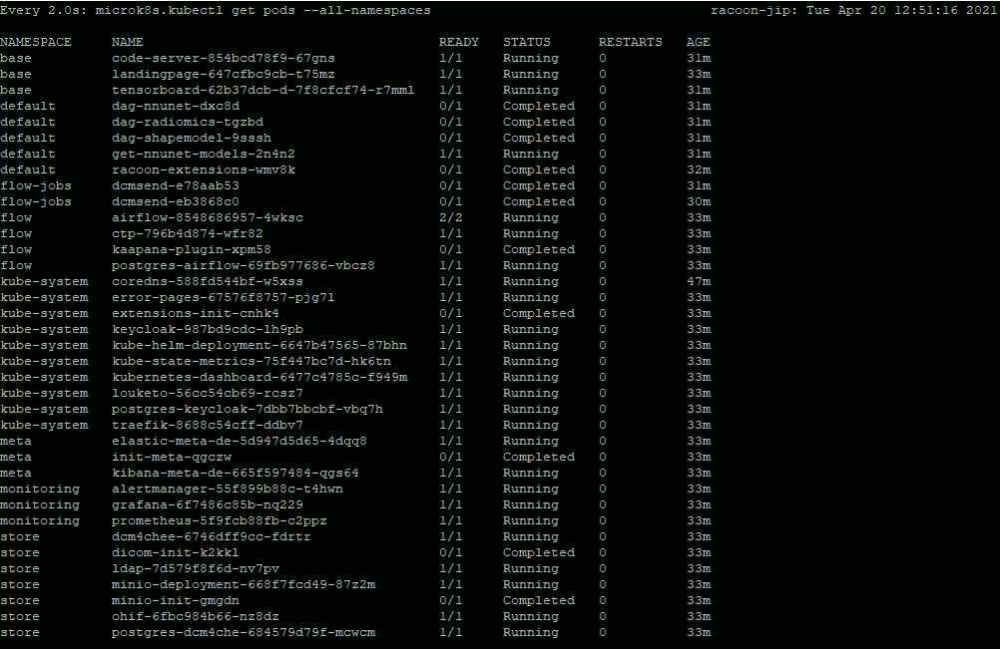

# Installation der Snapshot-VM (ohne internet access)

1) SSH in die VM 
    
    IP der VM war bei der installation: **10.1.10.31** (kann sich ändern)

    user: racoon

    pw:   GoRACOON21

2) **./install_racoon.sh** ausführen

3) GPU? -> yes
   
4) DOMAIN: IP des Servers (der Server auf dem die VMs laufen)
   
5) Warten bis das Deployment abgeschlossen ist
   
6) Überprüfung: **watch microk8s.kubectl get pods --all-namespaces**
   
7) Wenn bei STATUS bei allen Einträgen "running" oder "completed" steht, ist die Installation abgeschlossen. Im NAMESPACE "default" und "flow-jobs" müssen bei Installation alle auf "completed" stehen!

   
8)  Aufruf UI der Platform über den Browser: https://DOMAIN-SERVER:9443
   
9)  Anmeldung mit:

-> Platfform UI:

    Username: kaapana
    password: kaapana

    -> Wechsel des Passworts

12) Installation Extensions:

    - Landing page 
    - Menü: Extensions
    - Oben "version-filter" auf "All" stellen
    - code-server-chart  -> INSTALL
    - nnunet-workflow    -> INSTALL
    - radiomics-workflow -> INSTALL
    - shapemodel-vdev-workflow -> INSTALL
    - jupyterlab-chart -> LAUNCH
    - tensorboard-chart  -> LAUNCH

13) Warten bis alle Extensions laufen
14) Überprüfen ob alle Menü-Punkte erreichbar sind
15) Überprüfen ob bei "FLOW" alle Kreise grün sind.
16) Überprüfen ob die installierten Workflows gelistet werden (kann 1-3 min dauern!):
    
    - nnunet-ensemble
    - nnunet-model-install
    - nnunet-model-uninstall
    - nnunet-predict
    - nnunet-train
    - radiomics-dcmseg
    - shapemodel-organ-seg

17) DONE

Andere Passwörter:

-> Admin Login Keycloak (user-management von der Plattform, erreichbar über Menu: System auf Landing page):

    Username: racoon-admin
    password: EjsH53fXznKMtVFfwXxS

# Neue VM

Betriebssystem image:

    Ubuntu-20.04-server

Festplatten (Je nach Verfügbar, aber ungefähr)
  
    -> 20% des Systemspeichers -> Anpassung der System-partition auf die resultierende Größe

    -> 80% des Systemspeichers -> Data disk mounted at /mnt/data (fs btrfs)

Credentials of VM:
  
    user: racoon

    pw: GoRACOON21

# NVIDIA Treiber 
    
check if NVIDIA present: sudo lshw -C display

sudo apt update && sudo apt upgrade -y
sudo apt install nvidia-driver-450-server -y

Stop hibernation settings:
sudo systemctl mask sleep.target suspend.target hibernate.target hybrid-sleep.target

Testen des Treibers mit:

    nvidia-smi
     -> Tabelle mit GPU wird angezeigt 

# Installation Plattform

Benötigte Dateien aus dem zip-file:
- install_server.sh
- install_racoon.sh
- change_port_template.yaml

Benötigt werden zudem Username und Passwort für die container-registry:

-> Credentials für das Installations-skript (registry credentials):

    Username: racoon
    password: EjsH53fXznKMtVFfwXxS 

Testen der HDDs:

    df -h /home -> ~20% des Gesamtspeichers verfügbar
    df -h /mnt/data -> ~80% des Gesamtspeichers verfügbar

install_server.sh auf die VM übertragen. Hierzu in der VM:

    nano install_server.sh
    das Skript öffnen wo verfügbar (vermutlich Host-System)
    den Skript-Inhalt in den Nano-Terminal kopieren
    Mit nano geöffnete Datei speichern und schließen: strg +x -> y -> enter
    Datei executable machen: chmod +x install_server.sh

install_racoon.sh auf die VM übertragen. Hierzu in der VM:

    nano install_racoon.sh
    das Skript öffnen wo verfügbar (vermutlich Host-System)
    den Skript-Inhalt in den Nano-Terminal kopieren
    Mit nano geöffnete Datei speichern und schließen: strg +x -> y -> enter
    Datei executable machen: chmod +x install_racoon.sh

change_port_template.yaml auf die VM übertragen. Hierzu in der VM:

    nano change_port_template.yaml
    das Skript öffnen wo verfügbar (vermutlich Host-System)
    YAML in das Nano-Terminal kopieren
    Mit nano geöffnete Datei speichern und schließen: strg +x -> y -> enter

Installation software dependencies:

    sudo ./install_server.sh
    Anweisungen folgen: -> no-proxy: yes
    Wenn abgeschlossen: **sudo reboot**

Installation JIP:

    ./install_racoon.sh
    username + password: **siehe oben**
    GPU? -> yes
    DOMAIN: IP des Servers (der Server auf dem die VMs laufen)
    Warten bis das Deployment abgeschlossen ist
    Überprüfung: **watch microk8s.kubectl get pods --all-namespaces**
    Wenn bei STATUS bei allen Einträgen "running" oder "completed" steht, ist die Installation abgeschlossen (ca. 10 min warten dann sollte alles laufen). Im NAMESPACE "default" und "flow-jobs" müssen bei Installation alle auf "completed" stehen!
    Aufruf UI der Platform über den Browser: https://DOMAIN-SERVER:8443
    Alle Extensions installieren, die auf der landing-page angezeigt werden. (Die nnUNet-model-downloads benötigen Zeit für den Download - am besten einfach ein paar h laufen lassen)

Danach un-deployment der platform:
    ./install_racoon.sh
    -> Uninstall platform 
    -> warten bis alles runtergefahren ist
    -> **offline-mode** in **install_racoon.sh** aktivieren: OFFLINE_MODE="false"

Ubuntu-User Passwort:

    sudo passwd racoon
    -> passwort GoRACOON21

Passwörter:

-> Initiale Anmeldung Plattform:

    Username: kaapana
    password: kaapana

    -> Wechsel des Passworts auf GoRACOON21

-> Admin Login Keycloak (user-management von der Plattform):

    Username: racoon-admin
    password: EjsH53fXznKMtVFfwXxS

Verwendete Ports:
9443   -> User-interface
8081   -> Authentifizierungsserver
11113 -> DICOM port (AE-titel = dataset innerhalb der Plattform)

# Zertifikate hinzufügen

Um Zertifikate zur Platform hinzuzufügen, müssen die TLS Zertifikate (tls.key und tls.public) neben das install_racoon.sh Skript gelegt werden. Danach lassen sich die Zertifkate wie folgt installieren:

    ./install_racoon --install-certs

# Nutzer hinzufügen

Die JIP nutzt Keycloak zur Authentifizerung. Keycloak ist für Admins über die Landing page unter dem Menüpunkt "System" oder unter "/auth" erreichbar. Über "Administration Console" kommen Sie mit den oben angegeben Login Daten zur Keycloak-Oberfläche. Allgemeine Infos zu Keycloak finden sich [hier](https://www.keycloak.org/documentation.html).

Es lassen sich manuell User zu Keycloak hinzufügen oder über eine Verbindung zu einer Active Directory. Kaapana Platform User lassen sich über das Realm "Kaapana" und Keycloak-Admin User über das Realm "Master" konfigurieren. Das Realm lässt sich links oben wechseln. Nur in Ausnahmen sollten Änderungen im Master Realm gemacht werden. Die folgenden Beispiele werden alle im Kaapana Realm beschrieben.

* **Manuell einen User hinzufügen**:
    - Wechseln zum "Kaapana" Realm
    - Auswählen des Reiters **Users**
    - **View all users**
    - **Add user**
    - Username und weiter Felder ausfüllen. "Email" und "Required user actions" sollten leer gelassen werden
    - Mit **Save** den User speichern
    - Danach auf **Credentials** und das Passwort setzen
    - Unter **Role Mappings** muss man dem User noch die Rolle **user** und gegebenenfalls die Rolle **admin** geben. Ein **admin**-user hat zusätzlichen Zugriff auf die System und Monitoring Komponenten.
    - Um dem User Zugriff auf Minio zu geben, muss noch eine Read/Write Policy hinzugefügt werden. Hierzu auf **Attributes** gehen und unter **key** "policy" und **Value** "readwrite" hinzufügen.
* **Mit einer Active Directory verbinden**: Um eine Active Directory anzubinden den Reiter **User Federation** auswählen. Je nachdem welches Active Directory System vorhanden ist **ldap** oder **kerberos** auswählen. Die nötigen Konfiguration sollten Ihrer Institution vorliegen. Wenn alles richtig konfiguriert ist, sollten Sie sich über den AD-User auf die Plattform einloggen können. Die im oberen Beispiel genannten User Rollen sollten auch für AD-User konfigurierbar sein.
