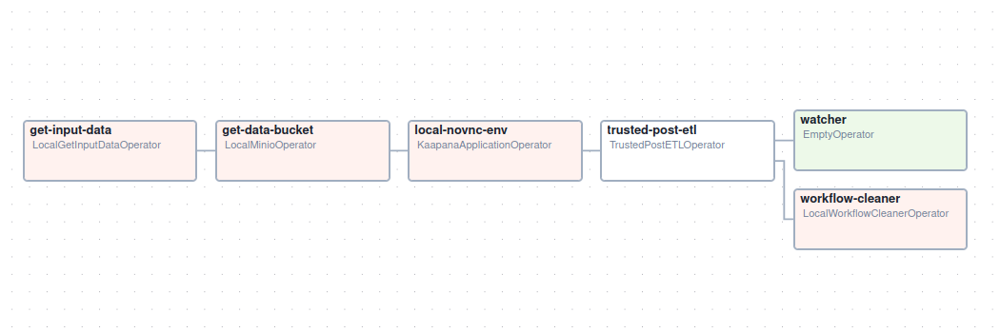
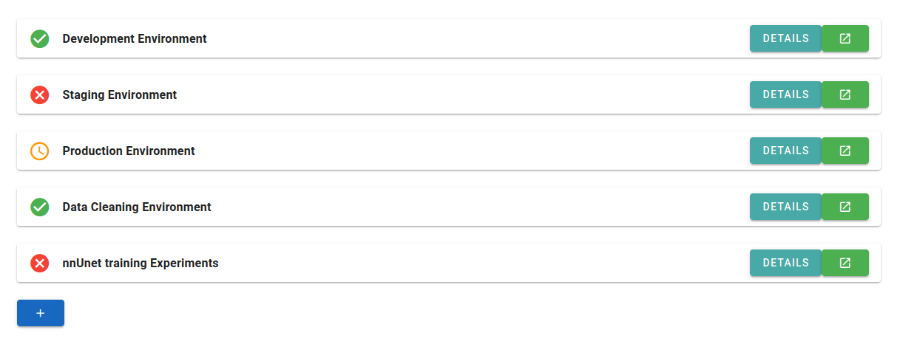
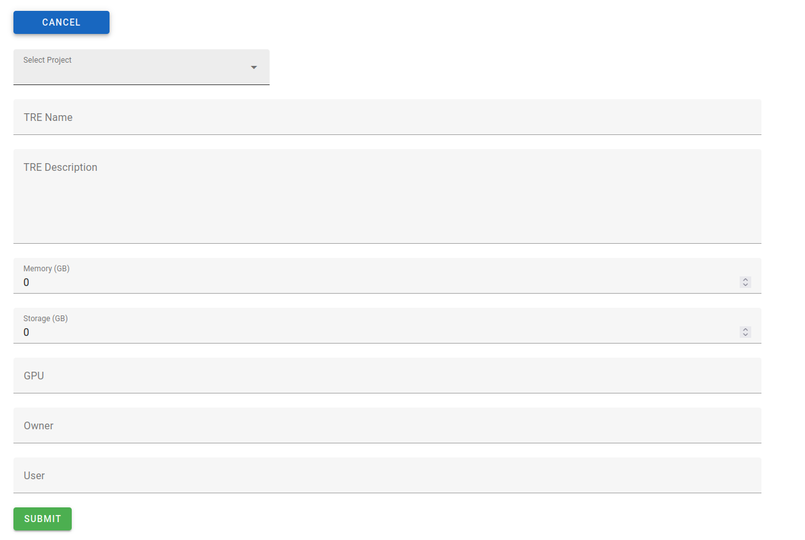
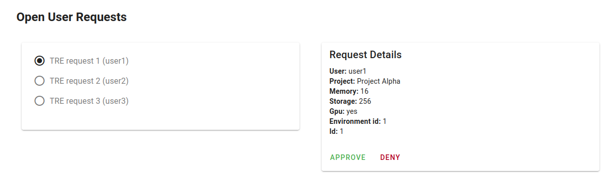

# Kaapana Trusted Research Environments
Trusted research environments (TRE) allow Kaapana users to spawn virtual desktop environments to work with data stored in the Kaapana Platform.
In this setting it is possivle to achieve that data is never stored in a persistent way outside of the Kaapana environment. Sometimes the term Secured Processing Environment is used to describe a similar setup. Even though the two terms differ in their precise definition, they will be used synonymously within this context. 

## DAGs
The backbone of the Kaapana TRE setup are the `vnc-spe-pod-orchestrator` and the `vnc-spe-vm-orchestrator` dags. Both start a virtual desktop environment. The `pod` operator spawns a new Kaapana pod within the help of the `KaapanaApplicationOperator`. The `vm` variant of the operator utilizes a openstack api and ansible scripts to spawn a new vm to host the virtual desktop environment. The dag can be started from the usual Workflow Execution tab in kaapana.

The get-input-data operator fetches data from the PACS system, the get-data-bucket fetches additional data (if needed) from minio. Then the local-novnc-env operator start a pod and copies the fetched data into the pod.
The trusted-post-etl operator is intended to allow administrators to review results of the TRE which are then downloadable. Im not entirely sure what the wtacher operator should do, but Kaushal told me it had something to do with holding everything open until it is actually finished. For the local-novnc-env this should not be necessary since the dag does not continue as along as the application started by the operator is pending, but maybe it is necessary for the vm version. Alternatively it might be necessary for the review process since the results are just stored in a specific directory and there might not be a pending application that holds the dag open. 

## Frontend
The frontend comes with two roles one for kaapana users who need to apply for new TREs or log into their existing ones. The second one for administrators who need to review applications, and either approve or deny them. 

### Technology
The frontend is build on the basis of Vue3 with vuetify3. The project inlcudes state management on the basis of pinia, but in the end I didn't user it. So if it is convenient to exchange it for something else or just to delete it, it should not cause problems. The project uses auto imports for pages and layouts (vuetify feature), nevertheless it is also possible to manually adapt the routing if needed. Note that "views" are called "pages" due to the setup of the project.

The layout is defined under `layouts/default.vue`. The views are defined in pages/TreAdminOverview.vue and pages/TreUserOverview.vue. An additional greeting page is in pages/TreBase.vue. I did not use isolated components (or depending of the perspective each page is it's own component).

### User View
The user view allows TRE users to overlook their research environments and apply for new ones. The green button with the "external link" symbol is intended to hold the link, which leads to the respective desktop environment.
The details button expands a drop down view to show detailed information about the respective environment. The status of the environment is reflected with an icon on the left side. 

The Button on the bottom expands into a form, where users can fill in information to apply for a new environment. The projects are selected from a list, maintained in the backend.

### Administrator View
The Administrator view allows administrators to check user-requests for new TREs. Request can be selected in the left column of the view and the respective details ar displayed at the right side. At the moment it just iterates through all fields of the objects which are deleivered by the `/api/requests` endpoint.  

The admin view also shows the currently running TREs.

## Backend
The backend is built with fastapi to maintain a number of API endpoints for the frontend. Some of them will be replaced with already existing (or future) endpoints of Kaapana. For databases I use sqlite for it's simplicity. If needed they could be exchanged for e.g. posgres. The schemas and tables are specified on the basis of sqlalchemy and pydantic (as they are in kaapana).

The backend maintains 3 databases:

- projects.db
- environments.db
- requests.db

#### porjects.db
The projects.db database is a placeholder for the Kaapana project managament, that is planned as a part of the "user-management and data separation system". In its current form it only projects only have fields for:

- id
- project_name
- owner

Note: The projects are intended to resolve access rights. So if a user gets access to an environment associated with a project, the user should also have access to all data that is associated with this project.  

#### environments.db
The environments.db is a database maintaining the tre objects. The fields contain information about the ressources used by the environment, the user who "owns" it (i.e. the user who is working with it), and the current state. In the current state it would not be functional to totally replace it with the kaapana pending applications endpoint (filtering for TRE links) but would need to be extended. So for each TRE the correct link must be entered in an extra "link" field. This is probably done easiest on the approval of the TRE. If I'm not mistaken the call to the "execute workflow" endpoint should return the id necessary to fetch "pending applications" for the correct link and enter it into the database. In hindsight this whole setup looks inefficient. An idea for a better approach is described in the "Open Considerations" section.

#### requests.db
The requests.db maintains user-requests (aka applications) for new TREs. The name is somewhat misleading since it can be confused with http requests, and in the code this can become unintentional, but the word application is also misleading and i don't now a better word. Probably it would have been better to name everything "tre_request" or something similar. Well the task is left to the interested reader, as my old mask book would tell. Requests maintain all information that is used to create new environments. The fields will need to be adapted for the actual call to the workflow execution. 

The repository contains a `populate_data.py` script to populate the database with some dummy data for development purposes.

# TODOs
- Package TRE UI with front and backend in a container.
- Exchange mocked backend endpoints for the correct kaapana ones:
    - Fetch Projects
    - Call dag via worklfow API to start new TRE
    - Fetch Running TREs
    - Link to running TREs
- Infer username from Kaapana user management/keycloak.
- integrate the TRE ui with the user management.
- integrate view to review results of finished TREs for administrators and approve users to download these results.

# Open Considerations
- At a certain point it might be nice to persist the state of virtual desktop environments. 

- Also I implemented the environments in a way that spawns a new "environment object" when a user applies for it. It then has the state pending until an administrator approves it.
In hindsight it would have been easier to implement and more intuitive for users if the application for a new environment only leads to a new environment_request object. This way users don't confuse open requests and running environments and the ui does not have to be cluttered with denied environments, which would have to be deleted manually in the current setup.

- In the current form there is now differentiation between site admins and porject admins (both roles are planned for the user management afaik). Probably this will never be necessary, since the user management will take care of the accessible ressources for each administrator, so projects-admins can only see requests and TREs, which are associated with their projects and site-admins will just see more/all requests and TREs. 

- Another Idea from the past was a quota management system that makes sure administrators only approve for ressources that do not exceed a certain limit. If the quota is assigned for each project this should be straight forward to implement. 