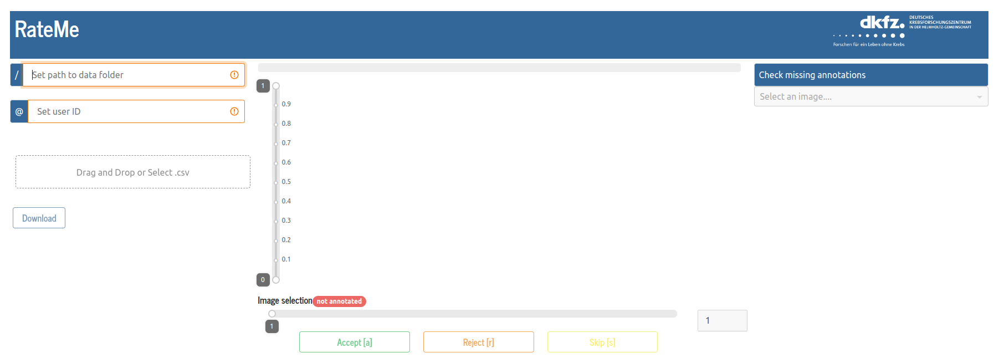

# RATEME


Annotation tool for 2D images implemented as a web application using Dash. It presents a set of images. The rater can accept, reject, or skip presented images. The results are stored in a dictionary and can be exported as a .csv file.

## How to run

```
pip install -r requirements.txt
python rateme.py
```

## How to use

On the left, the rater needs to define the path to the data folder and set a user ID that will be assinged to the annotations. Afterwards the images from the data folder will be loaded for display.

A progressbar on the top indicates how many of the provided images were already annotated. An image selection slider at the bottom allows to navigate through the image set. To annotate the current image selection, the rater can use the buttons at the buttom or the indicated keyboard shortcuts. A slider right next to the image allows to change the level window. On the right side, the rater can check which images still needs to be annotated and select them from a drop down menu.

The rating process can be resumed. Therefore, the rater can drag & drop or select a .csv file. This will then overwrite the current annotation labels.