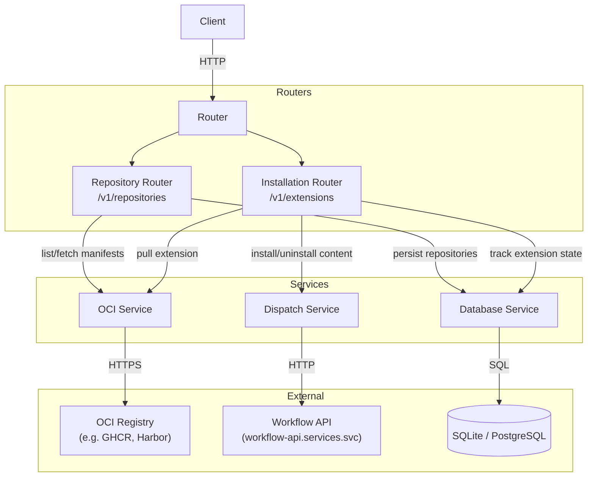
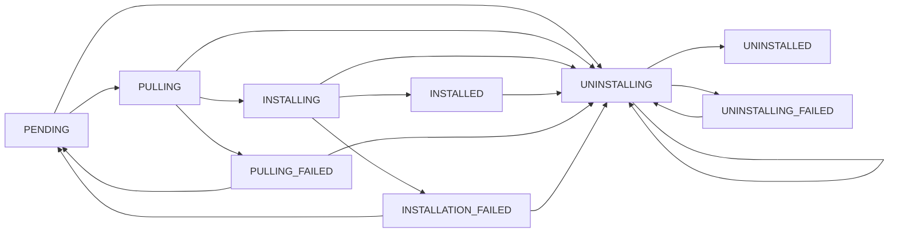
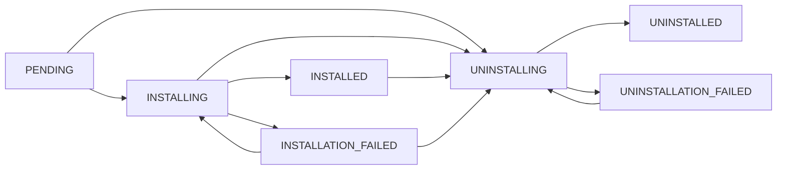
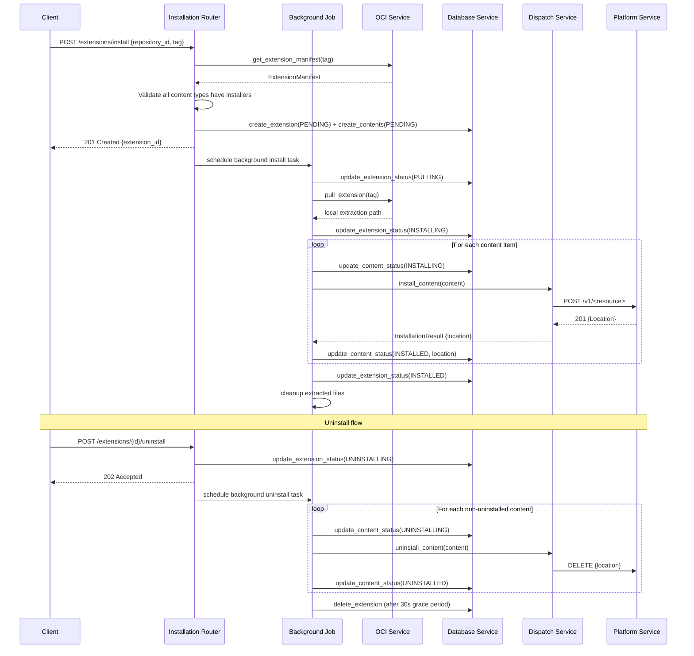

# Extension Manager Service

A FastAPI backend for discovering, installing, and managing extensions pulled from OCI-compatible container registries. Extensions package reusable content (e.g. workflows) that is dispatched to other platform services upon installation.

## Architecture



The service is versioned under `/v1/` and follows a layered architecture: HTTP routers handle request validation and response shaping, service modules encapsulate external communication, and SQLAlchemy models track persistent state.

---

## Objects

### `ExtensionManifest`

The central descriptor of an extension, stored as JSON in the database and used throughout the install lifecycle.

| Field          | Type                  | Description                                              |
|----------------|-----------------------|----------------------------------------------------------|
| `id`           | UUID string           | Stable identifier for the extension                     |
| `name`         | string                | Human-readable extension name                           |
| `version`      | string                | Semantic version string                                  |
| `contents`     | `Content[]`           | List of content items bundled in this extension         |
| `dependencies` | string[]              | Tags of other extensions this one depends on            |

### `Content`

A single installable unit within an extension. Each content item has a dedicated installer registered in the dispatcher.

| Field         | Type       | Description                                                  |
|---------------|------------|--------------------------------------------------------------|
| `name`        | string     | Identifier for this content item                            |
| `contentType` | string     | Determines which installer handles it (e.g. `workflow-v1`)  |
| `files`       | string[]   | File paths within the extracted extension bundle            |

### `Repository` (database)

Represents an OCI registry endpoint that the service can query.

| Field         | Type   | Description                                          |
|---------------|--------|------------------------------------------------------|
| `id`          | UUID   | Primary key                                          |
| `name`        | string | Unique human-readable label                          |
| `description` | string | Optional free-text description                       |
| `url`         | string | Base URL of the OCI registry host                    |
| `credentials` | string | Base64-encoded JSON `{"username": ..., "password": ...}` |

### `Extension` (database)

Tracks an installed (or in-progress) extension.

| Field           | Type              | Description                                            |
|-----------------|-------------------|--------------------------------------------------------|
| `id`            | UUID              | Primary key                                            |
| `repository_id` | UUID (FK)         | Which registry this was pulled from                    |
| `tag`           | string            | OCI tag used to pull this extension                    |
| `manifest`      | JSON              | Full `ExtensionManifest` at install time               |
| `status`        | `ExtensionStatus` | Current lifecycle state (see below)                    |
| `created_at`    | datetime          | First seen timestamp                                   |
| `updated_at`    | datetime          | Last status change timestamp                           |

The pair `(repository_id, tag)` is unique — the same tag cannot be installed twice from the same registry.

### `InstalledContent` (database)

Tracks each content item within an installed extension.

| Field        | Type            | Description                                                     |
|--------------|-----------------|-----------------------------------------------------------------|
| `id`         | UUID            | Primary key                                                     |
| `extension_id` | UUID (FK)     | Parent extension                                               |
| `name`       | string          | Content item name from the manifest                            |
| `type`       | string          | Content type (mirrors `contentType` in the manifest)           |
| `status`     | `ContentStatus` | Current lifecycle state                                        |
| `location`   | string \| null  | Resource URL returned by the installer after successful install |

### Status Enums

#### `ExtensionStatus`



The `UNINSTALLING → UNINSTALLING` self-loop allows re-triggering an uninstall on an extension that is already transitioning (e.g. if a previous uninstall task was lost mid-flight). `PULLING_FAILED → PENDING` and `INSTALLATION_FAILED → PENDING` are the retry arcs triggered by calling `POST /extensions/install` again.

#### `ContentStatus`



State transitions are validated in the CRUD layer — invalid transitions raise an exception rather than silently persisting bad state.

---

## Routers

### Repository Router — `/v1/repositories`

Manages the list of known OCI registries and exposes discovery endpoints.

| Method   | Path                                          | Description                                              |
|----------|-----------------------------------------------|----------------------------------------------------------|
| `POST`   | `/repositories`                               | Register a new OCI registry                             |
| `GET`    | `/repositories`                               | List registries (filter by `name` or `id`)              |
| `GET`    | `/repositories/{id}`                          | Get a single registry                                   |
| `PUT`    | `/repositories/{id}`                          | Update registry credentials or description              |
| `DELETE` | `/repositories/{id}`                          | Remove a registry                                       |
| `GET`    | `/repositories/{id}/extensions`               | List available extension tags in the registry           |
| `GET`    | `/repositories/{id}/extensionManifests`       | Fetch manifests for tags (optionally filtered by tag)   |

### Installation Router — `/v1/extensions`

Manages the install/uninstall lifecycle.

| Method | Path                              | Description                                     |
|--------|-----------------------------------|-------------------------------------------------|
| `POST` | `/extensions/install`             | Install an extension by repository and tag      |
| `GET`  | `/extensions`                     | List installed extensions (filter by tag, repo) |
| `GET`  | `/extensions/{id}`                | Get details for one installed extension         |
| `POST` | `/extensions/{id}/uninstall`      | Uninstall an extension                          |

---

## Services

### OCI Service

Wraps the `ExtensionUtilityLibrary` to communicate with OCI registries.

**Authentication** — Credentials are stored as a base64-encoded JSON blob (`{"username": ..., "password": ...}`). The service decodes them and validates login against the registry on construction.

**Fetching extension information** proceeds in two steps:

1. **Tag listing** — `get_extensions_for_repository()` calls the OCI catalog/tags API for the configured repository URL and returns the list of available tags. Each tag corresponds to one extension version.

2. **Manifest retrieval** — `get_extension_manifests(tags)` iterates the tag list and calls `get_extension_manifest(tag)` for each. The manifest is an OCI image config layer that encodes the `ExtensionManifest` JSON described above. The OCI library pulls the config blob, deserialises it, and returns typed `ExtensionManifest` objects.

**Pulling an extension** — `pull_extension(tag)` downloads and extracts the full OCI artifact to a local directory:

```
/extensions/{registry_hostname}/{tag}/
  extension_manifest.json
  <content-name>/
    <files listed in manifest>
```

The extracted path is passed to the dispatcher so each content installer can read its files.

After installation completes the background job removes the extracted directory.

### Dispatch Service

Routes each content item to the correct installer and abstracts the target platform service.

**`Dispatcher`** maintains a registry of `ContentInstaller` implementations. On `install_content()` / `uninstall_content()` it iterates registered installers, calls `can_install(content_type)`, and delegates to the first match. Raises `ContentTypeNotSupportedError` if no installer is found.

**`ContentInstaller`** (ABC) — all installers implement:
- `can_install(content_type: str) -> bool`
- `install(content: Content) -> InstallationResult`
- `uninstall(content: Content) -> None`

`InstallationResult` carries a `location` string — typically a URL returned by the target service — that is persisted in `InstalledContent.location` and used later for uninstallation.

**Adding a new content type** requires:
1. Subclass `ContentInstaller` and implement the three methods.
2. Register the instance with the `Dispatcher` at application startup.

**`WorkflowConsumer`** — the built-in installer for `workflow-v1` content:
- Reads `workflow.json` and `workflow_definition.py` from the extracted content directory.
- `POST`s the workflow payload to `http://workflow-api.services.svc:80/v1/workflows`.
- Stores the `Location` response header as `InstallationResult.location`.
- On uninstall, issues a `DELETE` to that stored URL.

### Database Service

Provides async SQLAlchemy CRUD operations over the `registries`, `extensions`, and `contents` tables.

Key behaviours:
- **Row-level locking** — `SELECT ... FOR UPDATE NOWAIT` prevents two concurrent requests from mutating the same extension or content row simultaneously. The lock fails immediately rather than waiting; concurrent attempts raise a `LockedExtensionException` which the caller surfaces as an HTTP 409.
- **Transition validation** — `update_extension_status` and `update_content_status` check the requested transition against an allow-list before committing. This enforces the state machines described above.
- **Cascade deletes** — deleting an extension removes all its `InstalledContent` rows automatically.

---

## Extension Lifecycle



### Install path

1. **Validate** — The router fetches the manifest from the OCI registry and checks that every `contentType` listed in the manifest has a registered installer in the dispatcher. If any type is unsupported the request is rejected immediately (no DB writes).
2. **Record** — An `Extension` row is created with status `PENDING`; one `InstalledContent` row is created per content item, also `PENDING`. If two concurrent requests race to install the same `(repository_id, tag)`, the database unique constraint resolves the conflict: the losing request detects the `IntegrityError`, loads the existing record, and retries the installation from there.
3. **Pull** — The background job transitions the extension to `PULLING` and calls `OCI.pull_extension()`, which downloads and extracts the OCI artifact locally.
4. **Install contents** — Status moves to `INSTALLING`. Content Items are installed consecutively; failures are collected and re-raised together as an `ExceptionGroup` so all results are captured.
5. **Finalise** — On full success the extension moves to `INSTALLED`. If any content item fails, the extension moves to `INSTALLATION_FAILED`; successfully installed items keep their `INSTALLED` status.
6. **Cleanup** — The extracted directory is removed regardless of outcome.

### Uninstall path

1. **Trigger** — The router synchronously transitions the extension to `UNINSTALLING` (enforced by the state machine, returns 409 if the extension is not in an uninstallable state), then schedules a background uninstall task.
2. **Uninstall contents** — Each `InstalledContent` that is not already `UNINSTALLED` is moved to `UNINSTALLING`, then the dispatcher calls the appropriate consumer which issues a `DELETE` to the stored `location` URL. Content still in `PENDING` state is driven through `UNINSTALLING → UNINSTALLED` as well (its `location` is `null`, the dispatcher throws a warning but succeeds).
3. **Remove record** — After a 30-second grace period the extension row (and cascaded content rows) is deleted from the database.
