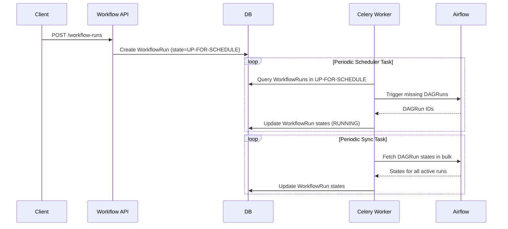

# Readme 

## Motivation
One key feature of Kaapana is the executing of *Workflows*.
A workflow consists of multiple steps that may depend on each other.
Commonly, these steps correspond to *tasks* like data-retrieval, pre-processing, processing, post-processing and result-persisting.
There exist several *Workflow Engines*, e.g. AirFlow, KubeFlow, ArgoCD, that are helpful for designing Workflows, scheduling *Workflow Runs* and monitoring their state.
Kaapana aims to be **agnostic** to the specific Workflow Engine that is most convenient for you to develop Workflows.
Hence, in Kaapana a Workflow simply corresponds to a *Workflow Definition* that is interpretable by the Workflow Engine of your choice,
e.g. for Airflow a dag-file corresponds to the Workflow Definition

Furthermore, Kaapana wants to provide a **unified interface** that supports an exclusive list of commonly required actions when managing Workflows and their execution:
* **Post Workflows**
* **Configuring Workflow Execution**
* **Receiving lifecycle information on Workflow Runs and Task Run**
* **Manually post lifecycle events to TaskRuns and WorkflowRuns, e.g. *CANCELED*, *RETRY***
* **Receiving logs of Task Runs**

This interface will be provided in the form of a **stable Rest API**.

Having this interface in Kaapana will help to have a clear **separation of concerns** in its API landscape.
The exclusive feature list will help to keep the code base **clean and free of convoluting features**.

### Admin API
Additionally to the Workflow API we will provide admin Rest endpoints for housekeeping e.g.:
* Delete archived objects
* Update objects

## Architecture
### Connection to Workflow Engines
The Workflow API is by concept independent of any Workflow Engine.
Therefore, a component is required that handles communication between the Workflow API and any Workflow Engine.
We will call this component *Workflow Engine Adapter*.
It will utilize the Workflow API to handle the following actions:
* Receive Workflow Definitions and create them in a Workflow Engine.
* Validate that Workflow Definitions are valid.
* Fetch WorkflowRuns from the Workflow API and:
    * If state is up-for-scheduling -> Schedule in Workflow Engine
    * If state is Running -> Update state depending on corresponding state of the Worklfow Execution in Workflow Engine
    * If state is CANCELED -> Cancel Workflow Execution in Workflow Engine
    * If state is RETRY -> Retry Workflow Execution in Workflow Engine
* ...

## Design desicions
### Labels
One key design decision is to allow very generic labeling of objects in the Workflow API.
The main purpose for labels is, that clients can easily add information to objects that determine how they should be handled my other clients.
In this context note, that the Workflow API is not responsible that a Workflow Run is scheduled on a Workflow Engine.

**Examples:**
* A *Workflow Engine Adapter* can fetch only those Workflow Runs with a specific label and schedule them on the corresponding Workflow Enigne
* A collection of Workflow Runs could be tight together by a unique value of an `kaapana.experiment` label

### Celery as basis of the Workflow Engine Adapter
Current implementation creates two tasks in Celery whenever a WorkflowRun is created:
* One for triggering the DAG
* Upon success: Two tasks one for monitoring the state of the DagRun and its TaskRuns.
This blocks two Celery workers until the DagRun ends in a final state.

A more scalable implementation relies on two periodic tasks,
* One that trigger Workflows that are Up-For-Schdeduling
* Another one that syncs states from Airflow to The Datbabase in bulk.

### Comparison of different approaches for connecting the Workflow API to Workflow Engines
| Approach            | Example Frameworks            | Core Idea                                      | Pros                                                      | Cons                                                           | Best For |
|---------------------|-------------------------------|------------------------------------------------|-----------------------------------------------------------|----------------------------------------------------------------|----------|
| **Task Queue**      | Celery, RQ, Dramatiq, Huey    | Push jobs into a queue, workers consume them   | Mature ecosystem, retries, distributed, Python-native     | Can get noisy with many per-run tasks, state drift, coupling   | General background jobs, async triggers |
| **Scheduler**       | APScheduler, K8s CronJobs     | Run periodic reconciliation loops              | Simple, low overhead, easy to reason about                | Not event-driven, can add latency, single point unless scaled  | Periodic sync tasks, controller-style loops |
| **Event Bus**       | Kafka, RabbitMQ, SQS, PubSub  | Emit events (`WorkflowRunCreated`), consumers react | Decoupled, resilient, scalable, multiple consumers possible | Extra infra complexity, less Python-native, requires ops team | Large-scale, multi-service event-driven systems |
| **Workflow Engine** | Temporal, Argo Workflows      | Engine manages state transitions + retries     | Strong guarantees, history, retries, observability        | Heavyweight, steep learning curve, locks you into model        | Complex workflows, compliance/audit requirements |

## Glossary

* Workflow:
* WorkflowEngine:
* WorkflowDefinition:
* WorkflowRun:
* WorkflowExecution: 
* Task:
* TaskRun: